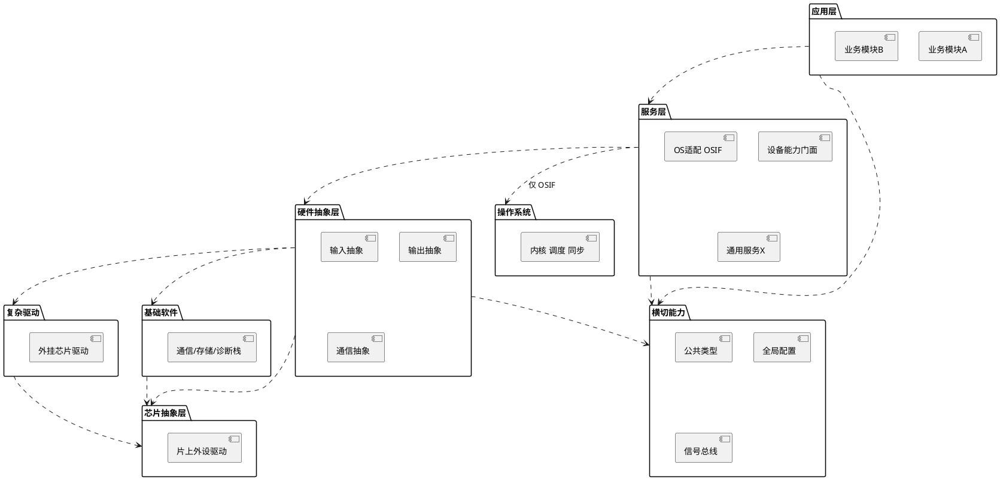
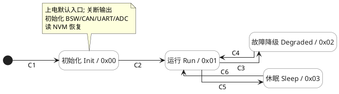
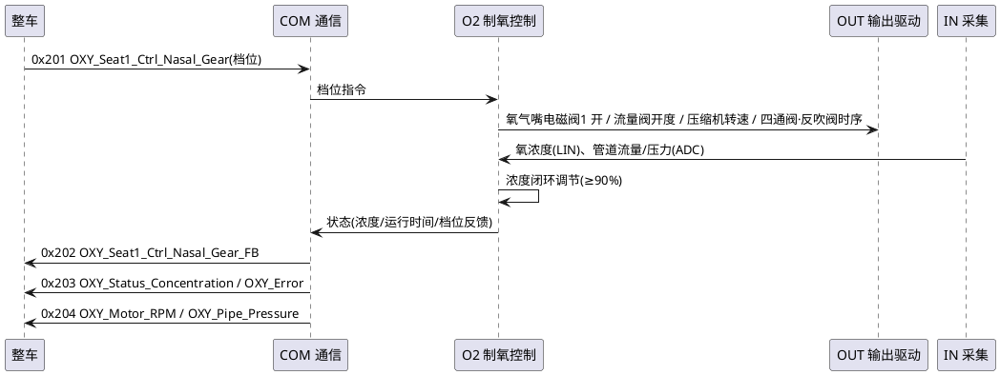

# 三类必含图画法（统一 PlantUML）

SAD 的图**全部用 PlantUML 源码**内嵌在 Markdown 里（```plantuml``` 代码块或 `@startuml`/`@enduml`）。
md 阶段只写源码不渲染；出 docx 时 `render_diagrams.py` 把每块渲成 PNG 再嵌入。

通用约定：
- 图开头加白底与透明分组背景，避免状态色块被遮：
  ```
  skinparam backgroundColor #FFFFFF
  skinparam SequenceGroupBodyBackgroundColor transparent
  skinparam SequenceGroupBackgroundColor transparent
  ```
- **PlantUML 消息标签换行用 `\n`，不要用 `<br/>`**（`<br/>` 会被当纯文本渲染）。
- 中文标签直接写（plantuml 支持中文）；箭头标注的 CAN 信号用真实名，取自 `parse_can_matrix.py`。
- 每张图下方用一行注明它**覆盖的需求**：`> 覆盖：<PREFIX>_SRS_XXX_001~007`（前缀随本项目 SRS），喂给 `trace_check.py`。

---

## ① 软件分层架构图（→ 7.2.1 分层架构）

这张图不只是插图，它是**全文依赖关系的唯一事实源**。7.2.3 组件表的「依赖」列、第 8 章各组件的
「外部接口(依赖)」行都必须与它一致——`scripts/layer_check.py` 会把三处解析出来交叉比对，不一致就报错。
所以画之前先把规则定下来，画完立刻跑一次检查。

### 必须同时表达的五条规则

只画「上层依赖下层」是不够的。一张能用来评审的分层图必须让下面五件事都可判定：

| 规则 | 图上怎么体现 | 不写会怎样 |
|---|---|---|
| **单向向下** | 箭头一律自上而下 | 下层反向调上层，编译期成环 |
| **不越层** | 只画相邻层箭头；确需直达的写成**显式声明的结构边** | 上层直连底层驱动，抽象层被架空 |
| **层内隔离** | 同层模块并排、模块间不画箭头 | 同层互相 include，出现模块环 |
| **平级分支互不依赖** | 平级层**并排**在同一水平带，带内不画横向箭头 | 两条可选驱动栈被误画成串行必经层 |
| **横切层任意可用** | 画成**右侧竖条**，虚线连到使用者层，不占层序 | 横切能力被塞成一个普通层，依赖方向被误导 |

同层模块确需协作时，机制要在 7.2 里写明（信号总线 / 事件总线 / 回调 / 对方公开接口），不能默许直接互调。

### 层的选择

层数、层名、有哪些层**完全由项目定**，下面是嵌入式 MCU 项目常见的一套，按需增删：

- **应用层**：业务逻辑、功能编排、状态机。默认**不直接访问硬件抽象层及以下**。
- **服务层**：硬件能力门面、通用服务、协议适配、实时算法核。含一个 **OS 适配组件**，
  它是全工程访问 RTOS 的唯一网关。
- **硬件抽象层**：硬件无关接口，接口(`If`)与实现(`Impl`)分离以便替换和打桩。
- **复杂驱动 / 基础软件**：外挂芯片协议 与 AUTOSAR 基础软件栈。**二者平级、互不依赖**，
  都是可选分支，不是所有硬件访问的必经层。
- **芯片抽象层 / 操作系统**：寄存器级片上外设驱动 与 内核。**二者平级、互不依赖**，
  共同直接运行于 MCU 硬件之上——**不要画成「芯片层依赖 OS」或反之**。
- **横切层**：公共类型 / 全局配置 / 信号总线。零业务逻辑、零硬件依赖，任意层可用。

> 项目若不需要某一层（没有外挂芯片就没有复杂驱动层；不用 AUTOSAR 就没有基础软件层；
> 不需要共享状态就没有总线横切层），直接不画，不要为了凑齐而虚设空层。

### 骨架（占位名，务必换成项目真实层名与组件名）



注意骨架里**没有** `MCAL ..> OS`、没有 `CDD ..> BSW`、没有 `APP ..> HAL`——这三条正是最常被误画的边。
芯片抽象层与操作系统平级；复杂驱动与基础软件平级；应用层经服务层门面取用硬件能力。

> PlantUML 的 `package` 表达不了「平级并排」和「横切竖条」的版面语义（它只会纵向堆叠），
> 上面的骨架是**依赖关系**的正确表达。若需要版面也准确的成品图，用配置驱动的绘图脚本出图，
> 再在 7.2.1 以图片嵌入；此时 7.2.1 必须同时给一张**合法结构边表**，让 `layer_check.py` 有表可查。

### 合法结构边表（7.2.1 必附）

| 源层 | 目标层 | 用途 |
|---|---|---|
| 应用层 | 服务层 | 命令/目标值下发 |
| 服务层 | 硬件抽象层 | 硬件能力受控访问 |
| 服务层 | 操作系统 | **仅限 OS 适配组件** |
| 硬件抽象层 | 芯片抽象层 | 片内外设直达 |
| … | … | … |

表里没有的组合一律视为违规。这张表是 `layer_check.py` 的输入，也是它能导出
`--emit-layers` 层模型交给 `code-generator` 的依据。

### PlantUML 兼容要点（本机 v1.2020，务必遵守，否则图渲染失败）
1. **层间箭头连 package 的英文别名**：`package "应用层" as APP { … }` 后用 `APP ..> SVC`。
   **不要**用包标题字符串连箭头（会生成游离文字/小人，不是箭头）。
2. package 体必须**多行展开**，**不要**写成一行 `package "X" { [Y] }`（老版本报错）。
3. 组件名里**避免 `\n`、`(`、`)`、`/` 等字符**（会触发解析错）；要分隔就用空格。
4. **不要**用 `skinparam componentStyle rectangle`（该版本不识别）。

### 画完必跑
```bash
python3 scripts/layer_check.py --sad <sad.md>                      # 三处依赖交叉校验，必须 0 违规
python3 scripts/layer_check.py --sad <sad.md> --emit-layers <layers.json>   # 导出层模型给下游
```
若项目有「层内网关」（如 OS 适配组件被同层其它组件依赖），用
`--same-layer-allow <组件ID,…>` 声明，或写进 layers.json 的 `same_layer_allow`。

也可画一张 **软件上下文图**（3.4）：用 component 把本软件放中心，周边接外部系统、上位机、传感器、
执行器等，边上标接口类型与代表信号。

---

## ② 软件状态机图（→ 5.3 软件运行模式 / 5.4 软件功能模式）

**分两层，别混**（评审反复强调的设计立场）：
- **5.3 全局运行模式机** = 整机生命周期（初始化/运行/故障降级/休眠），**功能无关**、是总闸。**不要**把各功能
  内部状态（档位、模式选择…）塞进来——否则状态数随功能组合爆炸。所有功能由它统一门控（休眠全关、运行全开）。
- **5.4 软件功能模式** = 各功能各自的小状态机，且**并行独立**（项目有几个可独立启停的功能就有几台），
  用多台并排的 `state "X" as X { … }` 表示，**不要合并成一台组合大机**。

**每个状态机小节都用"三段式 + 设计要点"**（对齐公司既有 SAD，如 `软件架构/CPM_…` 文档的写法）：
1. **状态机图**（PlantUML state，下方统一风格）；**连线只标序号**（全局机 C1/C2…、功能机 F1/F2…），
   具体条件不写在连线上。
2. **状态说明表**：`内部状态编号 | 对外上报 | 状态 | 用途/职责 | 关键活动`（功能机可按功能分组：
   `功能机 | 状态 | 说明 | 关键活动/信号`）。
3. **状态转移条件表**：`序号 | 起始状态 | 跳转状态 | 跳转条件`；条件保留 `&&`/`||`/`!`、变量自然语言、
   可在 `//` 后回链需求 ID（注意 markdown 表格里 `|` 要写成 `\|`）。
4. **设计要点**：优先级、锁存/非锁存、跨机联动、门控关系等。

**PlantUML state 统一风格**（CPM 同款，本机 v1.2020 验证可渲染）：

> 覆盖：<回链该机实现的需求 ID，前缀随 SRS（如 OXY_SRS_PWR_001~005、OXY_SRS_DIAG_001）>

**全局运行模式机（5.3）——转移条件必须"功能感知"**（最易漏的点）：
- 休眠判据不能"只看总线静默"，必须是 **`所有功能空闲 && 无本地输入活动 && 总线静默 > 超时`**。
  只要任一功能还在本地运行（典型：用户用实体按键单独开启了某个功能，总线上却毫无动静），就必须保持运行态，
  否则会误休眠把正在用的功能关掉。故障态→休眠同理。
  *（示例：某车载项目的判据为「制氧/负离子/香氛均关 && 气源为内置 && 无按键活动 && 总线静默 > 5s」。）*
- 状态给**内部状态编号**（0x00…）；若通信矩阵没有专用"运行模式"上报信号，"对外上报"列写"故障经 0x203 OXY_Error
  反映"并标 TBD——**不要编一个矩阵里不存在的模式信号**。

**功能模式机（5.4）**：
- 多台并排、并行独立；休眠时统一回到关/空闲（受 5.3 门控）。每台机内部用 F 序号连线。
- **仲裁放在指令层**：多来源指令（本地输入 / 各总线通道）的优先级由通信或输入组件在指令层仲裁完，
  模式机只接收"仲裁后的有效指令"，状态里不表达仲裁。
  *（示例：某项目优先级为 按键 > CAN > UART。）*
- **跨机联动**写进设计要点，而不是画成状态机之间的连线。
  *（示例：安全保护机进入"停机"→请求主功能档位机置关 + 散热输出全开。）*
- 预留/未释放的功能标注"释放后在本机内扩展子态"，不编内容。

state 图兼容：状态名带 `/`（`Init / 0x00`）放在引号串里没问题；note 换行用 `\n`；多台并排机各写一个
`state "X" as X { … }`，`left to right direction` 控版面。

---

## ③ 各功能动态时序图（→ 第 9 章，每功能一张，标真实 CAN 信号）

> **时序图的箭头是「信息流」，不是「依赖」。** 两者方向可以相反，这一点必须在 7.2 里写明，
> 否则评审时无法判断一张时序图是否违反了分层：
> - **依赖方向**（编译期，谁 include 谁）：受分层规则约束，恒向下。
> - **信息流方向**（运行期，消息实际从哪流到哪）：可以自下而上。
>
> 下层要把事件送给上层，用**回调注册**或**事件/信号总线**：下层不认识上层，上层向下依赖总线，
> 信息上行而依赖不上行。因此「底层 ISR 把事件送到应用层」不是违规。
> 画状态上行、同层协作时，**把总线画成一个 participant**，或在图下注明经总线中转——
> 直接画 `功能模块 -> 聚合模块` 会被读成反向调用。

用 PlantUML `sequence`。participant 取 架构/组件层：外部系统（如整车、上位机）、通信组件、
各功能组件、输出/采集抽象，以及**信号总线**（若项目用总线做同层协作与状态上行）。
箭头标**真实信号**：`<报文ID> <信号名>`，方向按 `parse_can_matrix.py` 解析出的 S→R。

功能时序骨架（下例中的信号名/报文ID 取自某车载项目，务必换成本项目通信矩阵里的真实值）：

> 覆盖：<PREFIX>_SRS_XXX_001~007、<PREFIX>_SRS_YYY_001

要画的时序（每功能一张 + 模板固有）：
- 9.1 初始化时序 / 9.2 休眠时序（总线静默→存掉电记忆→休眠，≤1mA）/ 9.3 唤醒时序（报文·按键→恢复，≤200ms）
- 9.4 各功能：**项目 SRS 里每个功能 SWC 一张**（主功能、电源管理、故障诊断、各辅助功能、输入管理、
  显示上报、安全保护…按项目实际）。每张只标该功能真正用到的信号，不要把整份通信矩阵铺上去。

信号速查：`python3 scripts/parse_can_matrix.py <矩阵.xlsx> --signal <名字片段>` 给出报文ID/方向/起始位/单位。

---

## 渲染与排错
- `render_diagrams.py` 调 `plantuml -tpng`。语法错会在该图位置保留源码、其余照常——出 docx 后检查是否有
  未渲染的代码块，定位修语法（最常见：忘了 `@enduml`、消息里用了 `<br/>`、participant 名含空格未加引号）。
- 图较多时渲染需要几十秒，正常。
