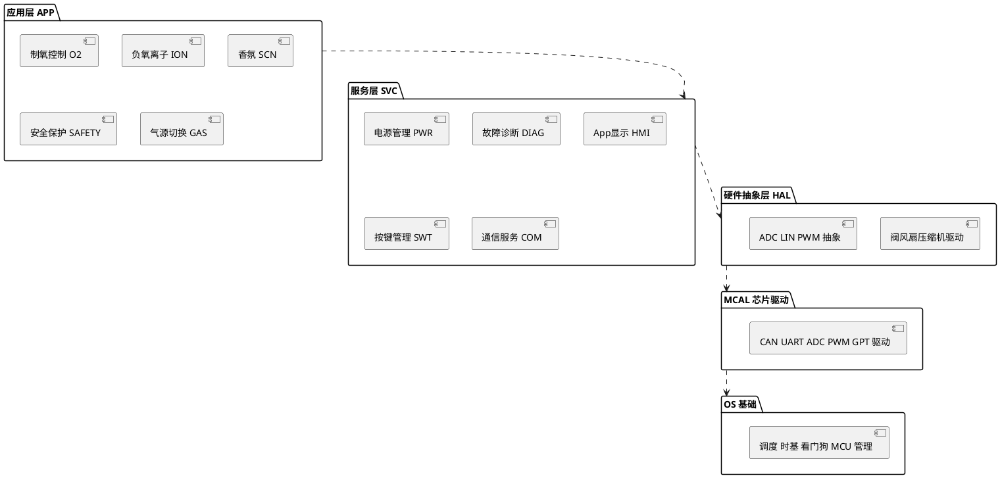
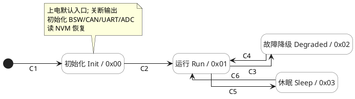
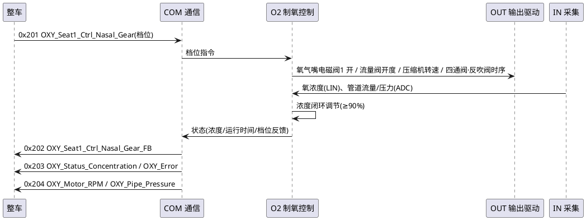

# 三类必含图画法（统一 PlantUML）

SAD 的图**全部用 PlantUML 源码**内嵌在 Markdown 里（```plantuml``` 代码块或 `@startuml`/`@enduml`）。
md 阶段只写源码不渲染；出 docx 时 `render_diagrams.py` 把每块渲成 PNG 再嵌入。

通用约定：
- 图开头加白底与透明分组背景，避免状态色块被遮：
  ```
  skinparam backgroundColor #FFFFFF
  skinparam SequenceGroupBodyBackgroundColor transparent
  skinparam SequenceGroupBackgroundColor transparent
  ```
- **PlantUML 消息标签换行用 `\n`，不要用 `<br/>`**（`<br/>` 会被当纯文本渲染）。
- 中文标签直接写（plantuml 支持中文）；箭头标注的 CAN 信号用真实名，取自 `parse_can_matrix.py`。
- 每张图下方用一行注明它**覆盖的需求**：`> 覆盖：HOD_SRS_O2_001~007`，喂给 `trace_check.py`。

---

## ① 软件分层架构图（→ 7.2.1 分层架构）

用 PlantUML `package` 表层、`component`/`rectangle` 表组件，自上而下 APP→SVC→HAL→MCAL→OS，层间用依赖箭头
（上层依赖下层）。各 SWC 落到所属层。骨架：


> 把 SRS 3.7.1 的 14 个 SWC 全部落层；层数/层名可按项目实际调整，但必须单向依赖（上→下）。
> **PlantUML 兼容要点（本机 v1.2020，务必遵守，否则图渲染失败）**：
> 1. **层间箭头连 package 的英文别名**：`package "应用层 APP" as APP { … }` 后用 `APP ..> SVC`。
>    **不要**用包标题字符串连箭头（`"应用层 APP" ..> "服务层 SVC"` 会生成游离文字/小人，不是箭头）。
> 2. package 体必须**多行展开**，**不要**写成一行 `package "X" { [Y] }`（老版本报错）。
> 3. 组件名里**避免 `\n`、`(`、`)`、`/` 等字符**（会触发解析错）；要分隔就用空格，如 `[App显示 HMI]`。
> 4. **不要**用 `skinparam componentStyle rectangle`（该版本不识别）。

也可画一张 **软件上下文图**（3.4）：用 component 把"制氧机软件"放中心，周边接 整车CAN、App(BLE)、按键、
氧传感器(LIN)、温压传感器(ADC)、阀/压缩机/风扇等，边上标接口类型与代表信号。

---

## ② 软件状态机图（→ 5.3 软件运行模式 / 5.4 软件功能模式）

**分两层，别混**（评审反复强调的设计立场）：
- **5.3 全局运行模式机** = 整机生命周期（初始化/运行/故障降级/休眠），**功能无关**、是总闸。**不要**把各功能
  内部状态（制氧档位、香氛香型…）塞进来——否则状态数随功能组合爆炸。所有功能由它统一门控（休眠全关、运行全开）。
- **5.4 软件功能模式** = 各功能各自的小状态机，且**并行独立**（O2/ION/SCN/GAS/SWT/SAFETY 各一台），用多台并排的
  `state "X" as X { … }` 表示，**不要合并成一台组合大机**。

**每个状态机小节都用"三段式 + 设计要点"**（对齐公司既有 SAD，如 `软件架构/CPM_…` 文档的写法）：
1. **状态机图**（PlantUML state，下方统一风格）；**连线只标序号**（全局机 C1/C2…、功能机 F1/F2…），
   具体条件不写在连线上。
2. **状态说明表**：`内部状态编号 | 对外上报 | 状态 | 用途/职责 | 关键活动`（功能机可按功能分组：
   `功能机 | 状态 | 说明 | 关键活动/信号`）。
3. **状态转移条件表**：`序号 | 起始状态 | 跳转状态 | 跳转条件`；条件保留 `&&`/`||`/`!`、变量自然语言、
   可在 `//` 后回链需求 ID（注意 markdown 表格里 `|` 要写成 `\|`）。
4. **设计要点**：优先级、锁存/非锁存、跨机联动、门控关系等。

**PlantUML state 统一风格**（CPM 同款，本机 v1.2020 验证可渲染）：

> 覆盖：<回链该机实现的需求 ID，前缀随 SRS（如 OXY_SRS_PWR_001~005、OXY_SRS_DIAG_001）>

**全局运行模式机（5.3）——转移条件必须"功能感知"**（最易漏的点）：
- 休眠判据不是"只看总线静默"，而是 **`所有功能空闲（O2/ION/SCN 均关 && GAS 内置 && 无按键活动）&& 总线静默 > 5s`**。
  只要任一功能在本地运行（如按键单独开了香氛/负离子）就保持 Run，否则会误休眠把功能关掉。故障态→休眠同理。
- 状态给**内部状态编号**（0x00…）；若通信矩阵没有专用"运行模式"上报信号，"对外上报"列写"故障经 0x203 OXY_Error
  反映"并标 TBD——**不要编一个矩阵里不存在的模式信号**。

**功能模式机（5.4）**：
- 多台并排、并行独立；休眠时统一回到关/空闲（受 5.3 门控）。每台机内部用 F 序号连线。
- **仲裁放在指令层**：按键>CAN>UART 优先级由 COM/SWT 在指令层仲裁，模式机只接收"仲裁后的有效指令"，
  状态里不表达仲裁。
- **跨机联动**写进设计要点：如 SAFETY"停机"→请求 O2 档位机置关 + 风扇全开。
- 预留功能（如 SCN 香型/浓度）标注"释放后在本机内扩展子态"，不编内容。

state 图兼容：状态名带 `/`（`Init / 0x00`）放在引号串里没问题；note 换行用 `\n`；多台并排机各写一个
`state "X" as X { … }`，`left to right direction` 控版面。

---

## ③ 各功能动态时序图（→ 第 9 章，每功能一张，标真实 CAN 信号）

用 PlantUML `sequence`。participant 取 架构/组件层：`整车`、`App`、`COM`、各 SWC（O2/PWR/DIAG…）、
`OUT(执行器驱动)`、`IN(采集)`。箭头标**真实信号**：`<报文ID> <信号名>`，方向按 `parse_can_matrix.py` 的 S→R
（0x201 控制 整车→制氧机；0x202/0x203/0x204 反馈/状态/参数 制氧机→整车）。

制氧控制时序（9.4）骨架：

> 覆盖：HOD_SRS_O2_001~007、HOD_SRS_HMI_001

要画的时序（每功能一张 + 模板固有）：
- 9.1 初始化时序 / 9.2 休眠时序（总线静默→存掉电记忆→休眠，≤1mA）/ 9.3 唤醒时序（报文·按键→恢复，≤200ms）
- 9.4 各功能：O2 制氧、PWR 电源、DIAG 故障诊断、ION 负氧离子、SCN 香氛、SWT 按键、HMI App、SAFETY 超温压
  保护、GAS 气源切换。每张标各自用到的真实信号（如 DIAG→0x203 OXY_Error；SAFETY→0x204 温度/压力；
  ION→0x203 ION_Ctrl_PM25_Count；GAS→0x201 Inter_Motor_Pause）。

信号速查：`python3 scripts/parse_can_matrix.py <矩阵.xlsx> --signal <名字片段>` 给出报文ID/方向/起始位/单位。

---

## 渲染与排错
- `render_diagrams.py` 调 `plantuml -tpng`。语法错会在该图位置保留源码、其余照常——出 docx 后检查是否有
  未渲染的代码块，定位修语法（最常见：忘了 `@enduml`、消息里用了 `<br/>`、participant 名含空格未加引号）。
- 图较多时渲染需要几十秒，正常。
