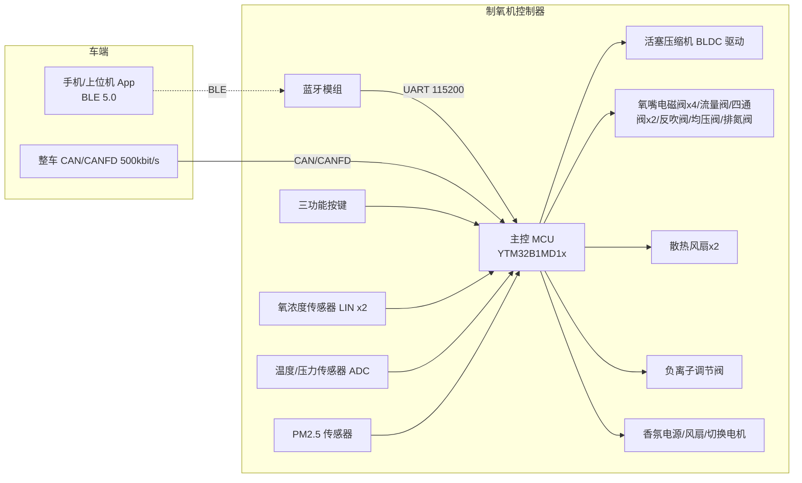
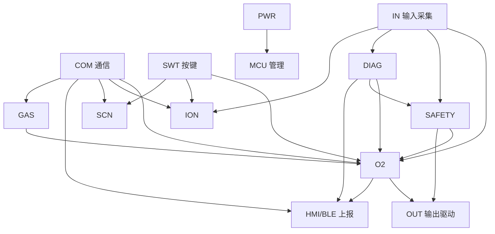
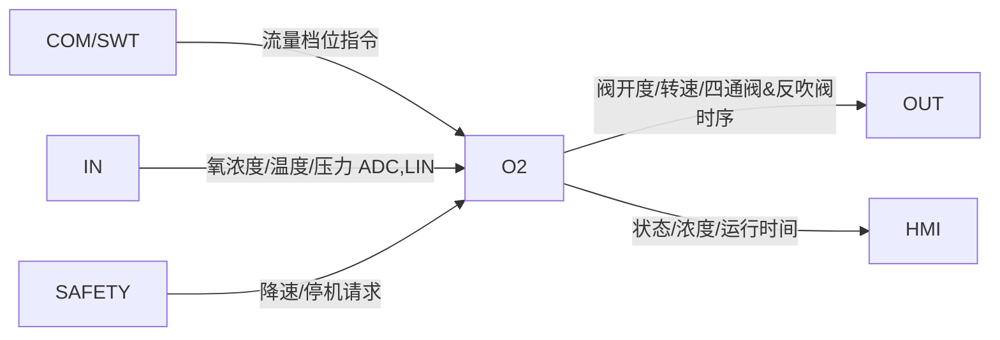
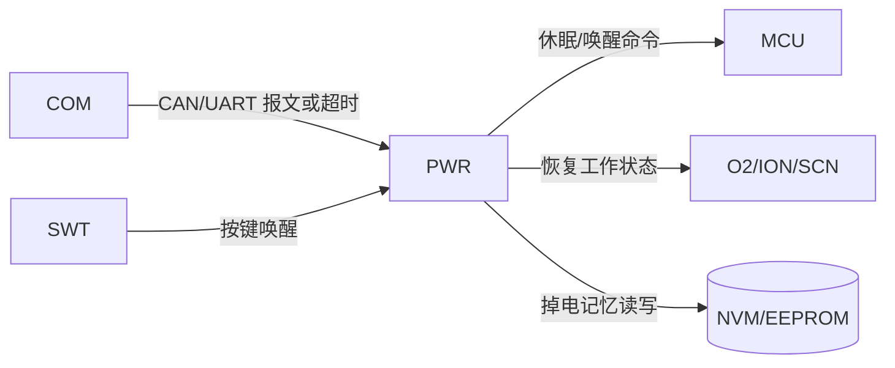
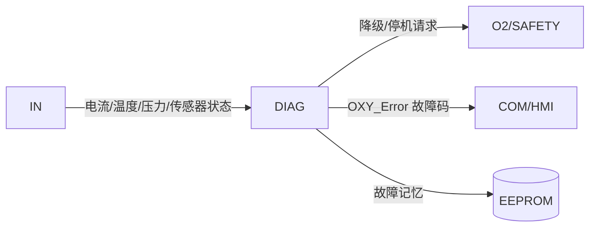

# 多功能制氧机 软件需求规范（SRS）— 初稿

> 模板：AU-QR-R&D-027 软件需求规范模板 V3.0（仅借结构，内容统一中文）
> 来源系统需求：多功能制氧机系统需求 V1.0_20260513-release
> 状态：Draft（初稿）　生成日期：2026-06-01
> 说明：缺信息处统一标 `【TBD-待补充：…】`，可用 `grep '【TBD'` 全局定位。ASIL 等级缺 HARA，统一标 `【TBD-待 HARA】`，未臆造。
> 追溯：每条软件需求"覆盖需求 Covered Req"字段回链系统需求 `SR-xx-xxx`（及产品需求 FR-/DIAG-/REL-）。

---

# 1 引言 Introduction

## 1.1 目标 Purpose
本文档定义多功能车载制氧机**软件层**需求，是在系统需求（SR-xx-xxx）基础上派生的软件需求规范（SRS）。
它按软件组件（SWC）组织，描述每个软件组件应实现的可验证行为，作为软件设计、实现、测试与验收的依据。

## 1.2 范围 Scope
覆盖运行于主控 MCU（YTM32B1MD1x）上的应用软件：制氧闭环控制、负氧离子、香氛、物理按键、App/蓝牙通信与显示、
安全保护、电源管理、故障诊断、标定（预留）、内/外置气源切换，以及基础平台（MCU 管理、输入采集、输出驱动、通信）。
不含机械、气路、硬件电路本体设计（这些在系统/硬件文档中）。

## 1.3 需阅读人员 Target Reader
软件设计开发人员、软件测试人员、系统工程师、功能安全/网络安全工程师、质量保证、项目管理。

## 1.4 术语和缩写 Terms & Abbreviations

| 术语/缩写 | 定义 |
|---|---|
| OXY | 制氧核心功能 Oxygen Generation Core Functionality |
| ION | 负氧离子功能 Negative Ion Generation |
| SCN | 香氛功能 Scent Diffusion |
| UI / HMI | 人机交互 User Interface & Interaction |
| SYS | 系统级管理 System-Level Management |
| SAFETY | 安全与法规 Safety & Regulatory Compliance |
| PSA / VPSA | 变压吸附 / 真空变压吸附 Pressure / Vacuum Pressure Swing Adsorption |
| BLE | 低功耗蓝牙 Bluetooth Low Energy 5.0 |
| CANFD | 灵活数据速率 CAN |
| UDS | 统一诊断服务 Unified Diagnostic Services |
| DTC | 诊断故障码 Diagnostic Trouble Code |
| SWC | 软件组件 Software Component |
| ASIL | 汽车安全完整性等级 Automotive Safety Integrity Level |
| BLDC/FOC | 无刷直流电机 / 磁场定向控制（压缩机驱动） |
| NVM | 非易失性存储器 |
| MTBF | 平均无故障时间 |

## 1.5 参考文献 References

| 缩略词 | 文档名称 | 参考 | 状态 | 版本 |
|---|---|---|---|---|
| SYSREQ | 多功能制氧机系统需求 | 系统需求/…V1.0_20260513-release.docx | Released | V1.0 |
| PRD | 多功能制氧机产品需求 | 产品需求/…V2.0_20260427.docx | Released | V2.0 |
| COMM | 制氧机通信矩阵 | 【TBD-待补充：文件未随附，需补《制氧机通信矩阵_v1.0》】 | — | V1.0 |
| HSI-PORT | 制氧机端口定义 | HSI/制氧机端口定义20260514.xlsx | Released | 20260514 |
| HSI-PIN | MCU 管脚定义 | HSI/…YTM32B1MD1x…20260529.xlsx | Released | 20260529 |
| HWREQ | 硬件需求规格说明书 | 外设/…_V01_20260521.xlsx | Released | V01 |

## 1.6 适用文件 Applicable documents

| 缩略词 | 文档名称 | 参考 | 状态 | 版本 |
|---|---|---|---|---|
| YY0732 | 医用制氧机 | YY 0732-2009 | 现行 | 2009 |
| GB8982 | 医用氧 | GB 8982-2009 | 现行 | 2009 |
| YY0505 | 医用电气设备电磁兼容 | YY 0505-2012 | 现行 | 2012 |
| NIO-CAN | CAN/CANFD 网络测试规范 | NIO-TS-0000031-V1.1 | 现行 | V1.1 |
| NIO-UDS | UDS 测试规范 | NIO-TS-0000033-V1.1 | 现行 | V1.1 |
| NIO-FLASH | Flash 烧录测试规范 | NIO-TS-0000034-V1.1 | 现行 | V1.1 |
| 编码规范 | 公司软件编码规范 | 【TBD-待补充：公司编码规范文档编号】 | — | — |

---

# 2 产品总览 Product Overview

产品外形图：【TBD-待补充：产品外形/PCBA 3D 图，系统需求文档此处为占位】

## 2.1 产品定义 Product identification

| 项 | 值 |
|---|---|
| 项目 ID Project ID | 【TBD-待补充：项目编号】 |
| 项目名 | 多功能车载制氧机 |
| 产品型号 | O2-1600（参考原理图 O2-1600-C260101）/【TBD-待确认】 |
| 客户 | 蔚来（NIO，依据引用的 NIO 测试规范）/【TBD-待确认】 |
| 制氧原理 | PSA/VPSA 分子筛吸附，输出氧浓度 90%~95% |
| 主控 MCU | YTM32B1MD1x |
| 供氧座位数 | 4 座独立供氧 |

## 2.2 功能列表 Function list

> ASIL 列因缺 HARA 暂全部 `【TBD-待 HARA】`。

| NO. | Level1 一级功能 | Level2 二级功能 | Level3/说明 | ASIL | 系统需求ID | 产品需求ID |
|---|---|---|---|---|---|---|
| 1 | 制氧功能 OXY | 4 座独立开关 / 流量 1~8L/min / 浓度闭环≥90% | 电磁阀+压缩机转速+四通阀/反吹阀 | 【TBD-待 HARA】 | SR-01-001 | FR-06-001~003 |
| 2 | 负氧离子 ION | 启停 / 浓度输出 / 臭氧控制 | PM2.5 代表洁净度 | 【TBD-待 HARA】 | SR-01-002 | FR-06-004 |
| 3 | 香氛 SCN | 香氛模块电源控制 | 上电供电 | 【TBD-待 HARA】 | SR-01-003 | FR-06-005~007 |
| 4 | 香氛（预留） | 3 香型 / 3 档浓度 / 香棒识别 | 预留 | 【TBD-待 HARA】 | SR-01-004 | FR-06-005~007 |
| 5 | 物理按键 SWT | 三功能独立开关 | 优先级 按键>CAN>UART | 【TBD-待 HARA】 | SR-01-005 | FR-06-008 |
| 6 | App 控制&显示 HMI/BLE | 4 座控制/流量/浓度/香型/状态上报 | UART↔BLE / CAN | 【TBD-待 HARA】 | SR-01-006 | FR-06-009~015 |
| 7 | 安全保护 SAFETY | 高氧浓度停机（预留）/ 超温/超压保护 | 温度/压力监控 | 【TBD-待 HARA】 | SR-01-008（注） | FR-08-002~003 |
| 8 | 电源管理 PWR | 休眠唤醒 / 掉电记忆 / CANFD 唤醒 | 电源状态机 | 【TBD-待 HARA】 | SR-01-009（注） | FR-06-001 |
| 9 | 故障诊断 DIAG | 压缩机/传感器/通信异常 / DTC | 检测周期 200ms | 【TBD-待 HARA】 | SR-01-010（注） | DIAG-07-001~002 |
| 10 | 标定 CAL（预留） | 流量校正 / 浓度保证≥90% | 预留 | 【TBD-待 HARA】 | SR-01-011 | REL-10-001~002 |
| 11 | 气源切换 GAS | 内/外置压缩机气源切换 | 活塞机停机+排氮阀 | 【TBD-待 HARA】 | SR-01-012 | — |

> 注：系统需求文档正文小节的内部编号（如 SR-01-008/009/010）与功能清单表 ID 存在偏移（清单中安全保护=SR-01-008、
> 电源管理=SR-01-009、故障诊断=SR-01-010）。本 SRS 以**功能清单表 ID**为追溯锚点，正文偏移已在各覆盖需求中说明。
> 【TBD-待补充：请系统需求方统一正文与清单的 SR-ID 编号】

## 2.3 产品背景 Product Context

系统逻辑框图（mermaid；最终 docx 阶段以 `硬件架构/制氧机框图_V01_20260514.vsdx` 转 PNG 替换/核对）：

## 2.4 产品变体 Product Variants
- 气源变体：内置活塞压缩机（12V/40A，PSA）/ 外置涡旋压缩机（48V/10A，VPSA），软件支持运行时切换（SR-01-012）。
- 电压平台：兼容 12V/24V/48V 车载（Demo 阶段按 12V 设计）。
- 其余软件变体见 3.3。

---

# 3 软件总体 Software Overall

## 3.1 软件产品概览 Software Product overview

| 项 | 值 |
|---|---|
| MCU 类型 | YTM32B1MD1x（依据 MCU 管脚定义表） |
| 主频 | 【TBD-待补充：主频，需 MCU 数据手册】 |
| Flash | 【TBD-待补充：Flash 容量】 |
| RAM | 【TBD-待补充：RAM 容量】 |
| 编译器 | 【TBD-待补充：编译器及版本】 |
| 架构 | AUTOSAR（系统需求 SR-07-015 要求支持 AUTOSAR）/【TBD-待确认 CP/AP】 |
| OTA | A/B 双分区升级（SR-07-015） |

## 3.2 软/硬件环境 Hardware / Software Context

HSI 概要（依据 `HSI/制氧机端口定义20260514.xlsx`，节选）：

| 接口 | 信号 | 电压 | 电流 | 说明 |
|---|---|---|---|---|
| CON1 | Oxygen_S / LIN / GND | 9~16V | 17mA | 氧浓度传感器供电 + LIN 通信 |
| CON2 | 12V-OUT / FAN- | 9~16V | 230mA | 散热风扇 |
| CON3 | EV / GND | 9~16V | — | 均压阀 |
| CON5 | ADC_NTC1 / GND | 5V | 0.5mA | 温度传感器 ADC |
| CON7 | Oxygen_SW / Fragrance_SW / Anion_SW / GND | 5V | 0.5mA | 三功能按键 |
| CON8 | 12V-IN / PGND / CAN_H / CAN_L | 9~16V | 25A | 电源输入 + CAN |

完整引脚↔信号映射：见 `HSI/制氧机-MCU_YTM32B1MD1x_MCU管脚定义_20260529.xlsx`（PINMUX 表，如 CAN0_TX=PTE_5、CAN0_RX=PTE_4）。

## 3.3 变体管理 Variants Management
### 3.3.1 硬件变体
内置活塞压缩机 / 外置涡旋压缩机两套气源（共用分子筛与电磁阀）。
### 3.3.2 软件变体
PSA/VPSA 双模式可配置；多车型适配（预留）。【TBD-待补充：变体编码与编译开关定义】

## 3.4 引导程序 Bootloader
【TBD-待补充：Bootloader 版本、刷写方式、UDS 服务、A/B 分区切换策略，需 Boot 规格文档；当前仅知需支持 A/B 分区 OTA（SR-07-015）与符合 NIO Flash 烧录测试规范】

## 3.5 通讯管理 Communication Management
- **CAN/CANFD**：车身总线，波特率 500kbit/s，支持唤醒。
- **UART**：与蓝牙模组通信，115200bps、8N1。应用层帧格式：`STX(0x7E) 报头(A5/AA) 长度 报文ID(0x01~04) 参数… Checksum ETX(0x7E)`；
  含 0x7E→0x7F 0x01、0x7F→0x7F 0x02 转义；Checksum=SUM(长度…参数N)。
- **CAN↔UART 映射**：CAN ID 0x201~0x204 对应 UART 报文 ID 0x01~0x04（数据内容一致，物理层不同）。
- **BLE 5.0**：App 通信，配对成功率≥99.9%。
- 报文：`OXY_Seat_ION_SCN_Ctrl`（控制）、`_FB`/`_FB2`（反馈）、`_Inter_Params`（内部参数）。
- **逐信号矩阵**：【TBD-待补充：各信号起始位/长度/因子/偏移/周期，需《制氧机通信矩阵_v1.0》（未随附）】

## 3.6 软件外部接口及信号映射 SW External Interfaces and Signal mapping

| 接口 | 名称 | 类型 | 描述 |
|---|---|---|---|
| CAN0 | 车身 CAN/CANFD | 数字总线 500kbit/s | 控制/反馈报文，支持唤醒；CAN0_TX=PTE_5, CAN0_RX=PTE_4 |
| UART | 蓝牙模组 | 串口 115200 8N1 | App 控制/状态，应用层协议见 3.5 |
| LIN | 氧浓度传感器 | LIN | 车内/管路氧浓度采集（CON1） |
| ADC | 温度/压力传感器 | 模拟 | 压缩机/管道/PCBA 温度、管道压力（CON5 等） |
| DI | 三功能按键 | 数字输入 5V | 制氧/负离子/香氛按键（CON7） |
| PWM/DO | 阀/风扇/压缩机/电机 | 数字/PWM 输出 | 电磁阀、风扇、香氛风扇 PWM、压缩机驱动 |

## 3.7 软件功能 Software Features

> **本节为建议性 SWC 分解**：项目无独立软件架构文档（见 gap_report G3），以下分解依据 mapping-guide 推导，**待软件架构评审确认**。

### 3.7.1 功能识别 Features Identification

| 软件组件 SWC | 缩写 | 描述 |
|---|---|---|
| MCU 管理 | MCU | 时基、上电初始化、看门狗、状态机调度 |
| 输入采集 | IN | 按键消抖、ADC 采样、LIN 氧浓度、PM2.5 采集 |
| 输出驱动 | OUT | 电磁阀/风扇/PWM/压缩机 PWM 驱动 |
| 通信 | COM | CAN/CANFD、UART、BLE 报文收发与转义 |
| 制氧控制 | O2 | 4 座供氧、流量档位、压缩机转速、四通阀/反吹阀时序、浓度闭环 |
| 负氧离子 | ION | 负离子阀启停、PM2.5 反馈 |
| 香氛 | SCN | 香氛电源（+预留香型/档位） |
| 按键管理 | SWT | 三功能长短按、优先级仲裁 |
| App/显示 | HMI/BLE | 状态聚合上报、控制下发 |
| 安全保护 | SAFETY | 温度/压力超限保护与降速 |
| 电源管理 | PWR | 休眠/唤醒/掉电记忆/CANFD 唤醒 |
| 故障诊断 | DIAG | 故障检测、DTC、EEPROM 记忆 |
| 标定 | CAL | 流量/浓度标定（预留） |
| 气源切换 | GAS | 内/外置气源切换、排氮阀 |

### 3.7.2 各功能模式适用性 Applicability

| 功能 \ 模式 | 休眠 | 唤醒/运行 | 故障降级 |
|---|---|---|---|
| O2/ION/SCN | 关 | 适用 | 受限/停机 |
| PWR | 适用 | 适用 | 适用 |
| DIAG | 部分（唤醒源监控） | 适用 | 适用 |
| SAFETY | 关 | 适用 | 适用 |

### 3.7.3 功能间接口 Interface between features

> 详细组件间数据/调用接口：【TBD-待补充：待软件架构文档定义信号级接口契约】

---

# 4 功能需求 Functional Requirements

> 组织顺序：基础平台 → 应用功能。下面 **O2（制氧）、PWR（电源管理）、DIAG（故障诊断）** 三个模块给出完整需求表；
> 其余模块列章节 + 代表性需求。所有需求表含模板全部 13 字段。ASIL 缺 HARA 统一 `【TBD-待 HARA】`。

## 4.1 功能 制氧控制 Feature O2

### 4.1.1 功能关联 Feature Context

### 4.1.2 功能输入输出描述 Feature Inputs/Outputs

输入：

| 名称 | 类型 | 范围 | 单位 | 描述 | 来源 | 目标 |
|---|---|---|---|---|---|---|
| OXY_SeatN_Ctrl_Nasal_Gear | enum | 0~7（0关/1=2L…4=8L,5~7预留） | 档 | 各座流量档位指令 | COM(CAN/UART) | O2 |
| 氧浓度值（管路） | analog/LIN | 0~100，误差±1.5 | % | 管路氧浓度 | 氧传感器(LIN,CON1) | O2/HMI |
| 管道流量 | analog | 0~20 | L/min | 流量检测 | 流量传感器 | O2 |
| OXY_Seat_Inter_Motor_Pause | bool | 0/1 | — | 内/外气源切换（联动 GAS） | COM | O2/GAS |

输出：

| 名称 | 类型 | 范围 | 单位 | 描述 | 来源 | 目标 |
|---|---|---|---|---|---|---|
| 氧气嘴电磁阀1~4 | DO | 开/关 | — | 各座供氧通断 | O2 | OUT→电磁阀 |
| 氧气管路流量调节阀开度 | PWM/档 | 0/25/50/75/100 | % | 对应 0/2/4/6/8 L/min | O2 | OUT |
| 压缩机转速 | 设定值 | 0/1200/1400/1600/1800 | rpm | 按流量档映射 | O2 | OUT→压缩机驱动 |
| 四通阀切换周期 | 时序 | 9/8/7/6 | s | 按转速映射 | O2 | OUT |
| 反吹阀开启时间 | 时序 | 8600/7600/6600/5600（+400） | ms | 按转速映射 | O2 | OUT |
| OXY_Status_Concentration | 反馈 | 0~100 | % | 氧浓度上报 | O2 | COM/HMI |
| OXY_Status_TotalTime/SessionTime | 反馈 | — | h/min | 累计/单次运行时间 | O2 | COM/HMI |

### 4.1.3 功能需求 Feature Requirements

| 字段 | 值 |
|---|---|
| 需求ID | HOD_SRS_O2_001 |
| 标题 | 各座供氧电磁阀通断控制 |
| 描述 | O2 应根据 OXY_SeatN_Ctrl_Nasal_Gear（N=1~4），档位>0 时开启对应氧气嘴电磁阀N，档位=0 或预留值时关闭对应电磁阀N。 |
| 类型 | Functional |
| 需求成熟度 | Draft |
| 变体 | NA |
| 分配 | O2 / OUT |
| 测试 | 单元测试 + HIL |
| ASIL | 【TBD-待 HARA】 |
| 功能 | 制氧控制 |
| 验证标准 | 4 座任意档位组合下，对应电磁阀通断状态与指令一致，反馈 OXY_SeatN_Ctrl_Nasal_Gear_FB 与设定一致。 |
| 覆盖需求 | SR-01-001（FR-06-001~003） |
| 发布计划 | 【TBD-待补充：发布里程碑】 |

| 字段 | 值 |
|---|---|
| 需求ID | HOD_SRS_O2_002 |
| 标题 | 流量档位→流量调节阀开度映射 |
| 描述 | O2 应按 4 座电磁阀信号值之和控制氧气管路流量调节阀开度：和=0→0%(0L/min)，=1→25%(2)，=2→50%(4)，=3→75%(6)，=4→100%(8L/min)。 |
| 类型 | Functional |
| 需求成熟度 | Draft |
| 变体 | NA |
| 分配 | O2 / OUT |
| 测试 | 单元测试 + HIL |
| ASIL | 【TBD-待 HARA】 |
| 功能 | 制氧控制 |
| 验证标准 | 各信号和取值下流量阀开度与上表映射一致；实测流量误差【TBD-待补充：流量精度判据】。 |
| 覆盖需求 | SR-01-001（FR-06-001~003） |
| 发布计划 | 【TBD-待补充】 |

| 字段 | 值 |
|---|---|
| 需求ID | HOD_SRS_O2_003 |
| 标题 | 流量档位→压缩机转速映射 |
| 描述 | O2 应按流量档设定压缩机转速：2L/min→1200rpm，4→1400，6→1600，8→1800rpm。 |
| 类型 | Functional |
| 需求成熟度 | Draft |
| 变体 | NA |
| 分配 | O2 / OUT（压缩机驱动） |
| 测试 | 单元测试 + HIL |
| ASIL | 【TBD-待 HARA】 |
| 功能 | 制氧控制 |
| 验证标准 | 各档转速设定值与映射一致；稳态转速误差【TBD-待补充：转速控制精度】。 |
| 覆盖需求 | SR-01-001 |
| 发布计划 | 【TBD-待补充】 |

| 字段 | 值 |
|---|---|
| 需求ID | HOD_SRS_O2_004 |
| 标题 | 四通阀与反吹阀时序控制 |
| 描述 | O2 应按压缩机转速设定四通阀切换周期与反吹阀开启时间：1200rpm→9s/8600ms，1400→8s/7600ms，1600→7s/6600ms，1800→6s/5600ms（反吹阀均+400ms）。 |
| 类型 | Functional / Timing |
| 需求成熟度 | Draft |
| 变体 | NA |
| 分配 | O2 / OUT |
| 测试 | HIL（时序示波器测量） |
| ASIL | 【TBD-待 HARA】 |
| 功能 | 制氧控制 |
| 验证标准 | 各转速下四通阀 A/B 路与反吹阀开关时序与设定吻合，周期误差【TBD-待补充：时序容差，系统文档参考时序图缺失】。 |
| 覆盖需求 | SR-01-001 |
| 发布计划 | 【TBD-待补充】 |

| 字段 | 值 |
|---|---|
| 需求ID | HOD_SRS_O2_005 |
| 标题 | 氧浓度闭环保证≥90% |
| 描述 | O2 应在各流量档位下，依据氧浓度反馈对压缩机转速/时序进行闭环调节，保证输出氧浓度≥90%。 |
| 类型 | Functional / Performance |
| 需求成熟度 | Draft |
| 变体 | NA |
| 分配 | O2 |
| 测试 | HIL + 整机标定测试 |
| ASIL | 【TBD-待 HARA】 |
| 功能 | 制氧控制 |
| 验证标准 | 全档位稳态氧浓度≥90%；闭环参数/周期【TBD-待补充：闭环控制策略与周期，需控制策略文档；浓度由标定保证】。 |
| 覆盖需求 | SR-01-001（FR-06-003）、SR-01-011（标定） |
| 发布计划 | 【TBD-待补充】 |

| 字段 | 值 |
|---|---|
| 需求ID | HOD_SRS_O2_006 |
| 标题 | 制氧状态与运行时间反馈 |
| 描述 | O2 应按报文周期实时反馈各座档位（_FB）、氧浓度值、累计运行时间（TotalTime_H/L）与单次运行时间（SessionTime）；总时间自压缩机启动累计、停止暂停，单次时间自启动清零计。 |
| 类型 | Functional / Interface |
| 需求成熟度 | Draft |
| 变体 | NA |
| 分配 | O2 / COM |
| 测试 | 集成测试 |
| ASIL | 【TBD-待 HARA】 |
| 功能 | 制氧控制 |
| 验证标准 | 反馈报文字段与内部状态一致，运行时间累计/暂停逻辑正确；报文周期【TBD-待补充：报文周期，需通信矩阵】。 |
| 覆盖需求 | SR-01-001、SR-01-006 |
| 发布计划 | 【TBD-待补充】 |

| 字段 | 值 |
|---|---|
| 需求ID | HOD_SRS_O2_007 |
| 标题 | 制氧前置条件检查 |
| 描述 | O2 应仅在供电电压正常(9~16V，±0.5V 精度)且无制氧相关故障(OXY_Error=0)时执行供氧动作，否则拒绝启动并维持安全状态。 |
| 类型 | Functional / Safety |
| 需求成熟度 | Draft |
| 变体 | NA |
| 分配 | O2 / DIAG / PWR |
| 测试 | 单元测试 + 故障注入 |
| ASIL | 【TBD-待 HARA】 |
| 功能 | 制氧控制 |
| 验证标准 | 欠/过压或 OXY_Error≠0 时不启动压缩机；恢复后可正常启动。 |
| 覆盖需求 | SR-01-001、SR-01-010 |
| 发布计划 | 【TBD-待补充】 |

## 4.2 功能 电源管理 Feature PWR

### 4.2.1 功能关联 Feature Context

### 4.2.2 功能输入输出描述 Feature Inputs/Outputs

输入：

| 名称 | 类型 | 范围 | 单位 | 描述 | 来源 | 目标 |
|---|---|---|---|---|---|---|
| CAN/UART 报文活动 | event | — | — | 总线报文/无报文超时 | COM | PWR |
| 按键唤醒 | DI | 0/1 | — | 任意功能按键按下 | SWT/IN | PWR |
| KL30 供电 | analog | 9~16 | V | 电源输入 | HSI(CON8) | PWR |

输出：

| 名称 | 类型 | 范围 | 单位 | 描述 | 来源 | 目标 |
|---|---|---|---|---|---|---|
| 电源状态 | enum | 休眠/运行 | — | 系统电源状态机 | PWR | MCU/全模块 |
| 休眠电流 | 约束 | ≤1 | mA | 休眠功耗目标 | PWR | — |
| 掉电记忆数据 | NVM | — | — | 工作状态/参数写入 | PWR | NVM |

### 4.2.3 功能需求 Feature Requirements

| 字段 | 值 |
|---|---|
| 需求ID | HOD_SRS_PWR_001 |
| 标题 | 总线超时进入休眠 |
| 描述 | PWR 应在连续未收到 CAN/UART 报文超过 5s(暂定)时使控制器进入休眠状态，休眠电流应≤1mA。 |
| 类型 | Functional |
| 需求成熟度 | Draft |
| 变体 | NA |
| 分配 | PWR / MCU |
| 测试 | 集成测试 + 电流测量 |
| ASIL | 【TBD-待 HARA】 |
| 功能 | 电源管理 |
| 验证标准 | 总线静默 5s 后进入休眠；实测休眠电流≤1mA。超时值待标定确认（系统文档标"暂定"）。 |
| 覆盖需求 | SR-01-009（SR-07-005 休眠电流） |
| 发布计划 | 【TBD-待补充】 |

| 字段 | 值 |
|---|---|
| 需求ID | HOD_SRS_PWR_002 |
| 标题 | 报文/按键唤醒 |
| 描述 | PWR 应在收到 CAN/UART 报文或检测到按键按下时，使控制器从休眠进入工作状态并开启 UART 与 CAN 通信。 |
| 类型 | Functional |
| 需求成熟度 | Draft |
| 变体 | NA |
| 分配 | PWR / COM |
| 测试 | 集成测试 |
| ASIL | 【TBD-待 HARA】 |
| 功能 | 电源管理 |
| 验证标准 | 报文或按键触发后唤醒≤200ms（SR-07-001）；唤醒后通信恢复。 |
| 覆盖需求 | SR-01-009、SR-07-001 |
| 发布计划 | 【TBD-待补充】 |

| 字段 | 值 |
|---|---|
| 需求ID | HOD_SRS_PWR_003 |
| 标题 | 掉电记忆与状态恢复 |
| 描述 | PWR 应在进入休眠前记忆相关工作参数（各功能状态、档位等），唤醒后恢复休眠前工作状态。 |
| 类型 | Functional |
| 需求成熟度 | Draft |
| 变体 | NA |
| 分配 | PWR / NVM |
| 测试 | 集成测试 + 掉电复位测试 |
| ASIL | 【TBD-待 HARA】 |
| 功能 | 电源管理 |
| 验证标准 | 休眠/掉电再上电后恢复原工作状态。记忆数据项清单见第 6 章。【TBD-待补充：记忆数据项定义】 |
| 覆盖需求 | SR-01-009 |
| 发布计划 | 【TBD-待补充】 |

| 字段 | 值 |
|---|---|
| 需求ID | HOD_SRS_PWR_004 |
| 标题 | 上电默认唤醒工作状态 |
| 描述 | PWR 应在控制器上电后默认进入唤醒工作状态。 |
| 类型 | Functional |
| 需求成熟度 | Draft |
| 变体 | NA |
| 分配 | PWR / MCU |
| 测试 | 单元测试 |
| ASIL | 【TBD-待 HARA】 |
| 功能 | 电源管理 |
| 验证标准 | 上电后控制器处于工作状态，CAN/UART 可通信。 |
| 覆盖需求 | SR-01-009 |
| 发布计划 | 【TBD-待补充】 |

| 字段 | 值 |
|---|---|
| 需求ID | HOD_SRS_PWR_005 |
| 标题 | 唤醒时序约束 |
| 描述 | PWR 应保证从休眠到唤醒就绪≤200ms，断电到发出第一帧报文<200ms。 |
| 类型 | Performance / Timing |
| 需求成熟度 | Draft |
| 变体 | NA |
| 分配 | PWR |
| 测试 | HIL（时序测量） |
| ASIL | 【TBD-待 HARA】 |
| 功能 | 电源管理 |
| 验证标准 | 唤醒就绪时间≤200ms；首帧延迟<200ms。 |
| 覆盖需求 | SR-01-009、SR-07-001 |
| 发布计划 | 【TBD-待补充】 |

## 4.3 功能 故障诊断 Feature DIAG

### 4.3.1 功能关联 Feature Context

### 4.3.2 功能输入输出描述 Feature Inputs/Outputs

输入：

| 名称 | 类型 | 范围 | 单位 | 描述 | 来源 | 目标 |
|---|---|---|---|---|---|---|
| 压缩机电流 | analog | 阈值 35A(暂定) | A | 过流检测 | IN/ADC | DIAG |
| 压缩机温度 | analog | 阈值 70℃(暂定) | ℃ | 过温检测 | IN/ADC | DIAG |
| 风扇/阀/传感器状态 | DI/diag | 正常/故障 | — | 开路/故障检测 | IN | DIAG |
| 压力传感器 | analog | — | Bar | 压力传感器故障 | IN/ADC | DIAG |

输出：

| 名称 | 类型 | 范围 | 单位 | 描述 | 来源 | 目标 |
|---|---|---|---|---|---|---|
| OXY_Error | enum | 0~8 | — | 故障码（见 DIAG_002） | DIAG | COM/HMI |
| 故障记忆 | NVM | — | — | DTC 写入 EEPROM | DIAG | NVM |

### 4.3.3 功能需求 Feature Requirements

| 字段 | 值 |
|---|---|
| 需求ID | HOD_SRS_DIAG_001 |
| 标题 | 故障检测周期与判稳 |
| 描述 | DIAG 应以 200ms(暂定) 周期检测各故障条件，且对每类故障持续满足 3s(暂定) 后判定为故障。 |
| 类型 | Functional / Diagnostic |
| 需求成熟度 | Draft |
| 变体 | NA |
| 分配 | DIAG |
| 测试 | 单元测试 + 故障注入 |
| ASIL | 【TBD-待 HARA】 |
| 功能 | 故障诊断 |
| 验证标准 | 注入故障持续≥3s 被判定，短于 3s 不误报。周期/持续时间待确认（系统文档标"暂定"）。 |
| 覆盖需求 | SR-01-010（DIAG-07-001~002） |
| 发布计划 | 【TBD-待补充】 |

| 字段 | 值 |
|---|---|
| 需求ID | HOD_SRS_DIAG_002 |
| 标题 | 故障码定义与上报 |
| 描述 | DIAG 应将故障状态编码到 OXY_Error：0=无故障，1=压缩机过流，2=压缩机开路，3=压缩机过温，4=散热风扇故障，5=氧浓度传感器故障，6=流量调节阀故障，7=温度传感器故障，8=压力传感器故障，并经 _FB2 上报。 |
| 类型 | Functional / Interface |
| 需求成熟度 | Draft |
| 变体 | NA |
| 分配 | DIAG / COM |
| 测试 | 集成测试 + 故障注入 |
| ASIL | 【TBD-待 HARA】 |
| 功能 | 故障诊断 |
| 验证标准 | 各故障注入后 OXY_Error 取值与定义一致并正确上报。 |
| 覆盖需求 | SR-01-010 |
| 发布计划 | 【TBD-待补充】 |

| 字段 | 值 |
|---|---|
| 需求ID | HOD_SRS_DIAG_003 |
| 标题 | 压缩机过流检测 |
| 描述 | DIAG 应在压缩机电流>35A(暂定) 持续 3s(暂定) 时判定压缩机过流(OXY_Error=1)。 |
| 类型 | Functional / Diagnostic |
| 需求成熟度 | Draft |
| 变体 | NA |
| 分配 | DIAG |
| 测试 | 故障注入 |
| ASIL | 【TBD-待 HARA】 |
| 功能 | 故障诊断 |
| 验证标准 | 注入>35A 持续 3s 报 OXY_Error=1；阈值待标定。 |
| 覆盖需求 | SR-01-010 |
| 发布计划 | 【TBD-待补充】 |

| 字段 | 值 |
|---|---|
| 需求ID | HOD_SRS_DIAG_004 |
| 标题 | 压缩机过温检测 |
| 描述 | DIAG 应在压缩机温度>70℃(暂定) 持续 3s(暂定) 时判定压缩机过温(OXY_Error=3)。 |
| 类型 | Functional / Diagnostic |
| 需求成熟度 | Draft |
| 变体 | NA |
| 分配 | DIAG |
| 测试 | 故障注入 |
| ASIL | 【TBD-待 HARA】 |
| 功能 | 故障诊断 |
| 验证标准 | 注入>70℃ 持续 3s 报 OXY_Error=3。 |
| 覆盖需求 | SR-01-010 |
| 发布计划 | 【TBD-待补充】 |

| 字段 | 值 |
|---|---|
| 需求ID | HOD_SRS_DIAG_005 |
| 标题 | 传感器/执行器故障检测 |
| 描述 | DIAG 应检测散热风扇(=4)、流量调节阀(=6)、温度传感器(=7)、压力传感器(=8)、氧浓度传感器(=5)、压缩机开路(=2)故障，各持续 3s(暂定) 判定。 |
| 类型 | Functional / Diagnostic |
| 需求成熟度 | Draft |
| 变体 | NA |
| 分配 | DIAG / IN |
| 测试 | 故障注入 |
| ASIL | 【TBD-待 HARA】 |
| 功能 | 故障诊断 |
| 验证标准 | 各类故障注入后对应 OXY_Error 置位。开路/故障判据【TBD-待补充：各执行器/传感器诊断判据，需硬件诊断设计】。 |
| 覆盖需求 | SR-01-010 |
| 发布计划 | 【TBD-待补充】 |

| 字段 | 值 |
|---|---|
| 需求ID | HOD_SRS_DIAG_006 |
| 标题 | 故障记忆与清除 |
| 描述 | DIAG 应将故障状态记忆到 EEPROM；当故障条件未再满足持续 3s(暂定) 后清除对应故障状态位。 |
| 类型 | Functional |
| 需求成熟度 | Draft |
| 变体 | NA |
| 分配 | DIAG / NVM |
| 测试 | 集成测试 + 掉电测试 |
| ASIL | 【TBD-待 HARA】 |
| 功能 | 故障诊断 |
| 验证标准 | 故障写入 EEPROM 且掉电保持；故障消失 3s 后清除。DTC 与 UDS 服务映射【TBD-待补充：UDS DTC 定义】。 |
| 覆盖需求 | SR-01-010 |
| 发布计划 | 【TBD-待补充】 |

## 4.4 功能 负氧离子 Feature ION（代表性需求）

| 字段 | 值 |
|---|---|
| 需求ID | HOD_SRS_ION_001 |
| 标题 | 负离子阀启停 |
| 描述 | ION 应在 ION_Ctrl_Gear=1 时全开负氧离子流量调节阀，=0 时全关，并反馈 ION_Ctrl_Gear_FB 与 PM2.5(ION_Ctrl_PM25_Count)。 |
| 类型 | Functional |
| 需求成熟度 | Draft |
| 变体 | NA |
| 分配 | ION / OUT / COM |
| 测试 | 单元测试 + 集成 |
| ASIL | 【TBD-待 HARA】 |
| 功能 | 负氧离子 |
| 验证标准 | 指令与阀状态、PM2.5 反馈一致。臭氧控制【TBD-待补充：臭氧控制策略，系统文档未细化】。 |
| 覆盖需求 | SR-01-002（FR-06-004） |
| 发布计划 | 【TBD-待补充】 |

## 4.5 功能 香氛 Feature SCN（代表性需求）

| 字段 | 值 |
|---|---|
| 需求ID | HOD_SRS_SCN_001 |
| 标题 | 香氛模块电源控制 |
| 描述 | SCN 应在 KL30 上电后打开香氛系统供电；供电正常反馈 SCN_Ctrl_Gear_FB=1，未开启或过流反馈 SCN_Ctrl_Gear_FB=0。 |
| 类型 | Functional |
| 需求成熟度 | Draft |
| 变体 | NA |
| 分配 | SCN / OUT |
| 测试 | 单元测试 |
| ASIL | 【TBD-待 HARA】 |
| 功能 | 香氛 |
| 验证标准 | 上电后供电开启并正确反馈；过流场景反馈 0。过流阈值【TBD-待补充：香氛供电过流阈值】。 |
| 覆盖需求 | SR-01-003（FR-06-005~007） |
| 发布计划 | 【TBD-待补充】 |

> **香氛（预留 SR-01-004）**：3 香型/3 档浓度/香棒识别。该功能系统需求标记为预留，软件需求待系统需求释放后补充。
> 已知动作：SCN_Ctrl_Gear=1/2/3→香氛风扇 PWM 10%/50%/100%@10kHz；SCN_Ctrl_Type=1/2/3→切换电机旋转 60/120/180°。【TBD-待补充：香棒识别方式、浓度闭环】

## 4.6 功能 物理按键 Feature SWT（代表性需求）

| 字段 | 值 |
|---|---|
| 需求ID | HOD_SRS_SWT_001 |
| 标题 | 三功能按键长按切换与优先级仲裁 |
| 描述 | SWT 应识别制氧/负离子/香氛按键按下≥1s 的长按事件并切换对应功能开/关；控制优先级为 按键>CAN>UART。制氧按键开启时默认设为 4L/min(转速1400rpm,四通阀8s,反吹阀7600+400ms)。 |
| 类型 | Functional |
| 需求成熟度 | Draft |
| 变体 | NA |
| 分配 | SWT / IN |
| 测试 | 单元测试 + HIL |
| ASIL | 【TBD-待 HARA】 |
| 功能 | 物理按键 |
| 验证标准 | 长按≥1s 触发切换，短于阈值不触发；按键与总线指令冲突时按键优先。消抖时间【TBD-待补充：按键消抖参数】。 |
| 覆盖需求 | SR-01-005（FR-06-008） |
| 发布计划 | 【TBD-待补充】 |

## 4.7 功能 App 控制&显示 Feature HMI/BLE（代表性需求）

| 字段 | 值 |
|---|---|
| 需求ID | HOD_SRS_HMI_001 |
| 标题 | 状态聚合上报 |
| 描述 | HMI/BLE 应接收 OXY_Seat_ION_SCN_Ctrl 控制报文并按周期上报 _FB/_FB2/_Inter_Params（座位档位反馈、氧浓度、滤网提醒、故障码、累计/单次运行时间、PM2.5、压缩机转速/温度、管道温度/压力/流量、PCB 温度）。 |
| 类型 | Functional / Interface |
| 需求成熟度 | Draft |
| 变体 | NA |
| 分配 | HMI / BLE / COM |
| 测试 | 集成测试 |
| ASIL | 【TBD-待 HARA】 |
| 功能 | App 控制&显示 |
| 验证标准 | 上报字段与内部状态一致，App 显示正确；报文周期【TBD-待补充：需通信矩阵】。 |
| 覆盖需求 | SR-01-006（FR-06-009~015） |
| 发布计划 | 【TBD-待补充】 |

## 4.8 功能 安全保护 Feature SAFETY（代表性需求）

| 字段 | 值 |
|---|---|
| 需求ID | HOD_SRS_SAFETY_001 |
| 标题 | 超温散热与压缩机降速保护 |
| 描述 | SAFETY 应执行：压缩机/管道温度>60℃→散热风扇 100%@10kHz，二者<40℃→关风扇；PCBA>60℃→转速降 1200rpm，>80℃→0rpm，<50℃恢复；管道压力>2Bar→降 1200rpm，>3Bar→0rpm，<1Bar 恢复。 |
| 类型 | Safety / Functional |
| 需求成熟度 | Draft |
| 变体 | NA |
| 分配 | SAFETY / O2 / OUT |
| 测试 | HIL + 故障注入 |
| ASIL | 【TBD-待 HARA】 |
| 功能 | 安全保护 |
| 验证标准 | 各温度/压力阈值触发对应保护动作与恢复，行为与阈值表一致。 |
| 覆盖需求 | SR-01-008（FR-08-002~003） |
| 发布计划 | 【TBD-待补充】 |

> **高氧浓度停机（预留）**：氧浓度≥23.5% 停机报警系统需求标记为预留，软件需求待释放后补充。【TBD-待补充：高氧浓度停机阈值/双路径判断/ASIL，需功能安全分析】

## 4.9 功能 气源切换 Feature GAS（代表性需求）

| 字段 | 值 |
|---|---|
| 需求ID | HOD_SRS_GAS_001 |
| 标题 | 内/外置压缩机气源切换 |
| 描述 | GAS 应在 OXY_Seat_Inter_Motor_Pause=1 时打开排氮电磁阀并暂停活塞压缩机（转速置0），反馈 _FB=1；=0 时关闭排氮阀并恢复暂停前转速，反馈 _FB=0。切换气源时四通阀/反吹阀控制不受影响。 |
| 类型 | Functional |
| 需求成熟度 | Draft |
| 变体 | 内置/外置气源 |
| 分配 | GAS / O2 / OUT |
| 测试 | 集成测试 |
| ASIL | 【TBD-待 HARA】 |
| 功能 | 气源切换 |
| 验证标准 | 切换指令下排氮阀与压缩机转速动作正确，反馈一致，四通/反吹阀不受扰。 |
| 覆盖需求 | SR-01-012 |
| 发布计划 | 【TBD-待补充】 |

## 4.10 功能 标定 Feature CAL（预留）

> 标定功能系统需求标记为预留（SR-01-011 / SR-07）。软件需求待系统需求释放后补充。
> 已知方向：流量校正/补偿、浓度误差≤±1.5%、全档位浓度≥90%、标定参数掉电不丢失、工厂标定流程进入/退出。
> 【TBD-待补充：标定项清单、校正算法、标定参数表与存储定义】

## 4.11 基础平台 SWC（MCU/IN/OUT/COM，代表性需求）

| 字段 | 值 |
|---|---|
| 需求ID | HOD_SRS_COM_001 |
| 标题 | UART 应用层帧封装与转义 |
| 描述 | COM 应按应用层协议收发 UART 帧（STX=0x7E，报头 MCU→模组=0xAA/模组→MCU=0xA5，长度、报文ID 0x01~04、参数、Checksum=SUM(长度…参数N)、ETX=0x7E），并对数据区 0x7E→0x7F01、0x7F→0x7F02 转义。 |
| 类型 | Functional / Interface |
| 需求成熟度 | Draft |
| 变体 | NA |
| 分配 | COM |
| 测试 | 单元测试 |
| ASIL | 【TBD-待 HARA】 |
| 功能 | 通信 |
| 验证标准 | 含 0x7E/0x7F 的帧正确转义/还原，Checksum 校验正确；CAN 0x201~204↔UART 0x01~04 映射一致。 |
| 覆盖需求 | SYSREQ §CAN数据转UART通信协议、SR-01-006 |
| 发布计划 | 【TBD-待补充】 |

---

# 5 非功能需求 Non Functional Requirements

## 5.1 软件版本
【TBD-待补充：软件版本号与版本管理策略】

## 5.2 实时约束 Real-time Constraints
- 按键/App 指令响应≤200ms；状态更新≤200ms；断电到首帧报文<200ms（SR-07-001）。
- 故障检测周期 200ms(暂定)；休眠超时 5s(暂定)（SR-01-010 / SR-01-009）。
- 【TBD-待补充：各任务周期划分与调度时序预算】
- 覆盖需求：SR-07-001、SR-01-009、SR-01-010。

## 5.3 资源约束 Resource Constraints
- FLASH/RAM/NV-RAM 使用率≤80%；CPU 最大负载≤80%（SR-07-002、SR-07-003）。
- 整机 8L/min 制氧功耗≤500W（额定）。
- 【TBD-待补充：RAM/Flash 字节级预算、堆栈预算，需资源预算文档】
- 覆盖需求：SR-07-002、SR-07-003。

## 5.4 质量约束 Quality Constraints
### 5.4.1 文件命名规则
【TBD-待补充：遵循《公司软件文件命名规范》编号】
### 5.4.2 编码规范
【TBD-待补充：遵循《公司软件编码规范》编号（建议 MISRA C 对齐），需规范文档】
### 5.4.3 代码命名规范
【TBD-待补充：遵循《公司代码命名规范》编号】

## 5.5 设计规范 Design Constraints
- 支持 AUTOSAR 架构（SR-07-015）；支持 OTA A/B 分区升级。
- 【TBD-待补充：软件设计规范文档、分层与模块化约束】

## 5.6 可靠性 Reliability
- 工作温度 -40℃~+85℃；故障码可读便于维修（预留）；掉电故障记忆。
- 压缩机设计寿命 20000h、分子筛 5000h、整机 10 年/15 万公里（SR-07-004/005）。
- 覆盖需求：SR-07-004、SR-07-005。

## 5.7 安全性 Safety / Security
- **功能安全**：高氧浓度强制停机（"ASIL-B 思路"）、传感器双路径判断、硬件独立保护机制（SR-07-018，预留）。
  【TBD-待 HARA：本项目无 HARA/安全概念，无法定级；各需求 ASIL 与本节安全机制待 HARA 后补充】
- **网络安全**：蓝牙连接加密、固件签名校验、拒绝非法/未授权指令（SR-07-017，预留）。
  【TBD-待补充：网络安全需求需 TARA】
- 覆盖需求：SR-07-017、SR-07-018、SR-01-008。

---

# 6 非易失性存储器内容 Non-volatile Memory Content

## 6.1 数据内存内容定义 Data flash Content definition

已知需掉电保存项（依据系统需求"掉电记忆/故障记忆/标定参数不丢失"）：

| 数据项 | 说明 | 来源需求 | 地址/长度/默认值/掉电策略 |
|---|---|---|---|
| 工作状态记忆 | 各功能开/关与档位 | SR-01-009 | 【TBD-待补充】 |
| 故障码记忆 | OXY_Error / DTC | SR-01-010 | 【TBD-待补充】 |
| 累计运行时间 | TotalTime/累计天数月数 | SR-01-001/006 | 【TBD-待补充】 |
| 标定参数 | 流量/浓度校正（预留） | SR-01-011 | 【TBD-待补充】 |

> 【TBD-待补充：完整 NVM 数据字典（地址/长度/默认值/写策略/掉电保护），需存储与标定定义文档】

---

# 7 行业要求 Industry Requirements

- YY 0732-2009《医用制氧机》、GB 8982-2009《医用氧》、YY 0505-2012 EMC 二级医疗器械（SR-07-010，预留）。
- 车载 EMC 5 项测试；NIO 环境/EMC/CAN/UDS/Flash 测试规范（见 1.6）。
- 阻燃 UL94 V-0、控制板器件 AEC-Q200 车规级。
- DV/EMC 测试以具体测试大纲为准（SR-07-016）。
- 覆盖需求：SR-07-010、SR-07-016、SR-07-019。

---

## 附：系统需求覆盖自检

| 系统需求 ID | 已被覆盖的软件需求 | 备注 |
|---|---|---|
| SR-01-001 制氧 | O2_001~007 | 完整 |
| SR-01-002 负氧离子 | ION_001 | 代表性，臭氧待补 |
| SR-01-003 香氛 | SCN_001 | 完整（基础） |
| SR-01-004 香氛预留 | §4.5 占位 | 预留 TBD |
| SR-01-005 按键 | SWT_001 | 代表性 |
| SR-01-006 App | HMI_001、O2_006、COM_001 | 代表性 |
| SR-01-008 安全保护 | SAFETY_001 | 高氧停机预留 TBD |
| SR-01-009 电源管理 | PWR_001~005 | 完整 |
| SR-01-010 故障诊断 | DIAG_001~006 | 完整 |
| SR-01-011 标定 | §4.10 占位 | 预留 TBD |
| SR-01-012 气源切换 | GAS_001 | 代表性 |
| SR-07-001~019 非功能 | 第 5/7 章 | 已搬运，部分 TBD |

> 全文待办：可用 `grep '【TBD' srs_draft.md` 一次性列出。
