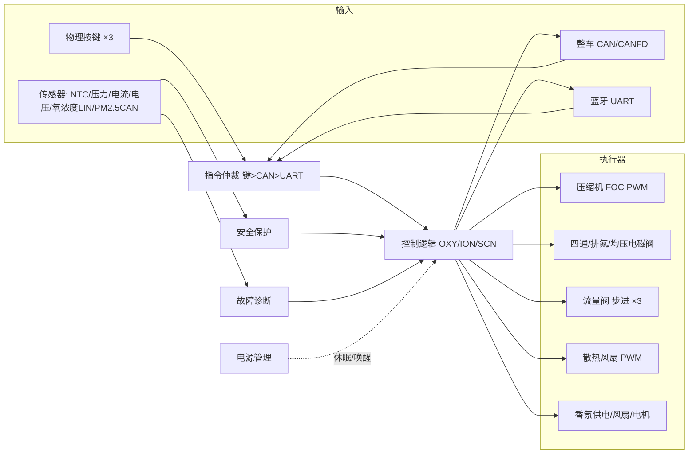

# 软件需求规范 / Software Requirements Specification (SRS)
## 多功能制氧机 Multi-function Vehicle Oxygen Generator

> 文档编号参照模板：AU-QR-R&D-027（SRS Template V3.0）
> 状态：**初稿 / Draft**（自系统需求 V1.0_20260513 派生）
> 说明：标注 **【TBD: …】** 处表示缺少输入，需补充后闭环（详见 `gap_report.md`）。

---

### 文档修订历史 / Doc Revision History

| No. | Revision | Change description | Author | Date |
|---|---|---|---|---|
| 1 | V0.1 (Draft) | 自系统需求 V1.0 派生初稿 | 【TBD】 | 2026-06-01 |

---

## 1. 引言 / Introduction

### 1.1 目标 / Purpose
本文档描述从系统需求规格说明书（《多功能制氧机系统需求 V1.0_20260513》）及相关 HSI、硬件需求派生的**软件功能需求、功能安全需求和性能需求**，用于指导后续多功能制氧机控制器的软件设计、实现与验证。

### 1.2 范围 / Scope
本文档适用于**多功能制氧机控制器**项目的软件设计与开发，覆盖制氧、负氧离子、香氛、人机交互（物理按键 / App）、电源管理、安全保护、故障诊断、通信（CAN/UART/LIN）、标定及外置气源切换等软件功能。功能安全（ASIL）、网络安全、UDS/Bootloader 详细规格在相应输入补齐后增补。

### 1.3 需阅读人员 / Target Reader
项目经理、项目组成员、功能安全经理/工程师、QA 与审查人员、产品测试人员、顾客代表、功能安全评估师及其他项目相关人员。

### 1.4 术语和缩写 / Terms & Abbreviations

| 术语 / Term | 定义 / Definition |
|---|---|
| OXY | 制氧核心功能 Oxygen Generation |
| ION | 负氧离子功能 Negative Ion |
| SCN | 香氛功能 Scent Diffusion |
| PSA / VPSA | 变压吸附 / 真空变压吸附 |
| ADC | Analog to Digital Converter |
| PWM | Pulse Width Modulation |
| CAN / CANFD | Controller Area Network (Flexible Data-rate) |
| LIN | Local Interconnection Network |
| UART | Universal Asynchronous Receiver/Transmitter |
| BLE | Bluetooth Low Energy |
| UDS | Unified Diagnostic Services |
| NVM / EEPROM | 非易失存储器 |
| MCU | 微控制器（本项目：YTM32B1MD1x，100LQFP） |
| ASIL | Automotive Safety Integrity Level |
| MTBF | 平均无故障时间 |
| HSI | Hardware Software Interface |

> 表1 术语、缩写及首字母缩略词 / Table 1 Terms & Abbreviations

### 1.5 参考文献 / References

| Acronym | 文档名称 Document title | 参考 Reference | 状态 | 版本 |
|---|---|---|---|---|
| SysReq | 多功能制氧机系统需求 | 系统需求/多功能制氧机系统需求V1.0_20260513-release.docx | Released | V1.0 |
| PRD | 多功能制氧机产品需求 | 产品需求/多功能制氧机产品需求V2.0_20260427.docx | Released | V2.0 |
| CommMatrix | 制氧机通信矩阵 | 通信矩阵_v1.0（**项目目录中缺失**） | 【TBD】 | V1.0 |
| HSI-Pin | MCU 管脚定义 | HSI/制氧机-MCU_YTM32B1MD1x_MCU管脚定义_20260529.xlsx | - | 20260529 |
| HSI-Con | 端口/连接器定义 | HSI/制氧机端口定义20260514.xlsx | - | 20260514 |
| HRS | 硬件需求规格说明书 | 外设/多功能制氧机_硬件需求规格说明书_V01_20260521.xlsx | Released | V01 |
| Load | 外围负载参数梳理 | 外设/多功能制氧机外围负载参数梳理V01_20260529.xlsx | - | V01 |
| HBD | 硬件框图 | 硬件架构/制氧机框图_V01_20260514.vsdx | - | V01 |

> 表2 参考文档 / Table 2 Reference documents

### 1.6 适用文件 / Applicable documents

| Acronym | 文档名称 | 状态 | 版本 |
|---|---|---|---|
| YY 0732-2009 | 医用制氧机 | 适用 | 2009 |
| GB 8982-2009 | 医用氧 | 适用 | 2009 |
| YY 0505-2012 | 医用电气设备电磁兼容 | 适用 | 2012 |
| NIO-TS-0000031 | CAN/CANFD Networking Test Spec | 适用 | V1.1 |
| NIO-TS-0000033 | UDS Test Spec | 适用 | V1.1 |
| NIO-TS-0000034 | Flash Programming Test Spec | 适用 | V1.1 |
| 软件编程指南 | AU-FS-R&D-605 Software Coding Guideline (MISRA C:2012) | 适用 | 【TBD】 |

> Table 3 Applicable documents

---

## 2. 产品总览 / Product Overview

多功能车载制氧机以环境空气为原料，采用 PSA/VPSA 分子筛吸附法制氧，输出氧浓度 90%~95%；集成负氧离子、香氛、蓝牙 App 控制、CAN 总线通信与多级安全保护，支持 4 座独立供氧控制。控制器以 MCU（YTM32B1MD1x）为核心，驱动活塞压缩机/外置涡旋压缩机、四通阀、反吹（均压）阀、流量调节步进电机、香氛风扇/电机、散热风扇，并采集温度（NTC）、压力、电流、电压、氧浓度（LIN）、PM2.5（CAN）等信号。

>  — Figure 2-1 产品概述（源自 HBD，需导出 PNG）

### 2.1 产品定义 / Product identification

| 项目 | 内容 |
|---|---|
| 项目ID Project ID | 【TBD】 |
| 项目名称 Project Name | 多功能制氧机 Multi-function Oxygen Generator |
| 项目类型 Project Type | 预研 / 量产【TBD】 |
| 产品类型 Product Type | 车载制氧控制器 ECU |
| 客户 Customer | 【TBD】（附录测试标准指向 NIO NT3） |
| 车辆 Vehicle | 【TBD】 |

> 表4 产品定义 / Table 4 Product identification

### 2.2 功能列表 / Function list

| NO. | 一级功能模块 | 二级功能模块 | ASIL | 系统需求 ID | 备注 |
|---|---|---|---|---|---|
| 1 | 制氧功能 OXY | 4 座电磁阀控制 / 流量档位 / 压缩机转速 / 四通阀+反吹阀时序 / 浓度反馈 | 【TBD】 | SR-01-001 | 4/6/8L 档预留 |
| 2 | 负氧离子 ION | 启停（流量调节阀）/ PM2.5 反馈 | QM | SR-01-002 | |
| 3 | 香氛 SCN | 香氛电源开关 / 过流反馈 | QM | SR-01-003 | |
| 4 | 香氛（预留） | 三香型 / 三档位 PWM 风扇 / 切换电机 | QM | SR-01-004 | 预留 |
| 5 | 物理按键 | 制氧/负离子/香氛三键，长按 1s | QM | SR-01-005 | 优先级 键>CAN>UART |
| 6 | App 控制&显示 | 控制接收 / 状态反馈 / 内部参数上报 | QM | SR-01-006 | |
| 7 | 安全保护 SAFETY | 超温/超压保护、散热风扇控制、降速/停机 | 【TBD ASIL-B?】 | SR-01-007 | 氧浓度停机预留 |
| 8 | 电源管理 SYS | 休眠/唤醒 / 掉电记忆 / CANFD 唤醒 | QM | SR-01-008 | |
| 9 | 故障诊断 DIAG | 压缩机/传感器/通信故障识别、故障码、EEPROM 记忆 | 【TBD】 | SR-01-009 | 阈值多处暂定 |
| 10 | 标定 CAL（预留） | 流量校正 / 浓度补偿 | QM | SR-01-010 | 预留 |
| 11 | 外置气源切换 | 暂停活塞压缩机 + 开排氮阀 | QM | SR-01-011 | |
| 12 | 通信处理 | CAN/CANFD 收发、UART（蓝牙）、LIN（氧浓度）、PM2.5 CAN | QM | SR-01-006/008 | 见 §3.6 |
| 13 | UDS 诊断 | 服务/会话/DTC | 【TBD】 | - | 缺规格 |
| 14 | Bootloader | A/B 分区 CAN 刷写、固件签名 | 【TBD】 | SR-07-015/017 | 缺规格 |

### 2.3 产品背景 / Product Context
系统由 MCU 控制器与以下外设构成（接口见 HSI）：
- **执行器**：内置四缸活塞压缩机（12V/40A，FOC 驱动）、外置涡旋压缩机（48V/10A）、四通阀×2 + 排氮/均压电磁阀、流量调节步进电机×3（制氧/负离子/散热前端）、香氛风扇/切换电机、散热风扇×2（48V PWM）。
- **传感器**：NTC 温度×（板/压缩机/管道）、压力传感器×2（ADC）、氧浓度传感器（LIN）、PM2.5 模块（CAN）、电流/电压采样（ADC）。
- **人机**：物理按键×3、蓝牙模块（UART）、调试串口。

> ![系统框图占位] — Figure 2-2 产品总览（导出自 HBD）

### 2.4 产品变体 / Product Variants
- 电压变体：12V / 24V / 48V（Demo 阶段按 12V 设计）。
- 气源变体：内置活塞压缩机（PSA）/ 外置涡旋压缩机（VPSA）。
- 【TBD：需正式变体矩阵与软件配置策略】

---

## 3. 软件总体 / Software Overall

### 3.1 软件产品概览 / Software Product overview

| 项 | 值 |
|---|---|
| MCU 类型 | YTM32B1MD1x（100LQFP） |
| 软件平台 | 【TBD：AUTOSAR / H&T SW platform，待定】 |
| Bootloader | UDS bootloader by CAN（A/B 分区，含固件签名）【TBD 规格】 |
| 变体数量 | 见 §2.4（电压/气源）【TBD 正式定义】 |
| 通信 | CAN/CANFD 500kbit/s、UART 115200bps（蓝牙）、LIN（氧浓度）、CAN（PM2.5） |

> Table 5 Product overview

### 3.2 软/硬件环境 / Hardware-Software Context
软硬件接口以 MCU 管脚定义（HSI-Pin）与端口定义（HSI-Con）为准。MCU 通过 ADC 采集温度/电流/电压/压力/版本，通过 eTMR PWM 输出驱动压缩机（FOC）、流量阀步进、电磁阀、风扇，通过 GPIO 采集按键并控制使能/电源开关，通过 CAN0/CAN1、LINFlexD、SPI 实现通信与外部 CAN 配置。

> ![HSI 占位] — Figure 3-1 硬件关联图（HSI diagram）

### 3.3 变体管理 / Variants Management
- **硬件变体**：12V/24V/48V 供电；内置/外置压缩机。
- **软件变体**：按车型/气源可配置（预留）。【TBD】

### 3.4 引导程序 / Bootloader
UDS over CAN，支持 A/B 双分区 OTA、固件签名校验。**详细规格缺失，见 gap_report B1-4。**【TBD】

### 3.5 通讯管理 / Communication Management
关联文档：通信矩阵 V1.0（**缺失**）；CAN↔UART 协议见系统需求（CAN ID 0x201~0x204 对应 UART 报文 ID 0x01~0x04）。UART 帧：1 起始位 / 8 数据位 / 无校验 / 1 停止位 / 115200bps，0x7E 帧定界并对 0x7E、0x7F 做转义。

### 3.6 软件外部接口及信号映射 / Software External Interfaces and Signal mapping

外部连接器列表（源自 HSI-Con，端口定义 20260514）：

| 接口 Connector | Pin/名称 | 类型 Type | 描述 Description |
|---|---|---|---|
| CON1 | Oxygen_S(12V) / LIN / GND | Power + LIN | 氧浓度传感器（LIN 通信，9~16V/17mA） |
| CON2 | 12V-OUT / FAN- | Power Out | 散热风扇 12V/230mA |
| CON3 | EV / GND | Power Out | 均压（反吹）阀 12V |
| CON5/CON12 | ADC_NTC1 / ADC_NTC2 | Analog In | 温度传感器 ADC（5V） |
| CON7 | Oxygen_SW / Fragrance_SW / Anion_SW | Digital In | 三物理按键（5V/0.5mA） |
| CON8 | 12V-IN / PGND / CAN_H / CAN_L | Power + CAN | 主电源 12V/25A + 整车 CAN |
| CON9 | PM_2.5(12V) / PM_CAN_H / PM_CAN_L | Power + CAN | PM2.5 模块（负氧离子检测，CAN1） |
| CON10/CON11 | Pressure_S(12V) / Pressure_ADC / GND | Power + Analog | 管道压力传感器×2 |
| CON13/CON14 | PSA_01 / PSA_02 (12V) | Power Out | PSA 四通/分离阀 |
| CON15 | SV (12V) | Power Out | 电磁阀 |
| CON16/17/18 | Stepper_M1/M2/M3（4 相） | Stepper | 流量调节阀（制氧/散热前端/负离子前端） |
| CON19 | Fragrance(12V) | Power Out | 香氛系统供电 |

> 表6 外部连接器列表 / Table 6 External connector list

### 3.7 软件功能 / Software Features

#### 3.7.1 功能识别 / Features Identification

| 功能名称 Feature Name | 描述 Brief description |
|---|---|
| MCU Management | MCU 抽象层：ADC、DIO、PWM、定时器、看门狗、NVM、时钟、电源域使能（5V/7V/12V）管理 |
| Oxygen Generation (OXY) | 4 座电磁阀控制、流量档位→流量阀开度、压缩机转速、四通阀/反吹阀时序、浓度闭环反馈 |
| Negative Ion (ION) | 负氧离子流量阀启停、PM2.5（CAN）采集与上报 |
| Scent (SCN) | 香氛电源开关与过流监测；（预留）三香型/三档风扇 PWM + 切换电机 |
| Switch Input Mgmt | 三按键去抖、长按 1s 识别、优先级仲裁（键>CAN>UART） |
| App/CAN/UART Comm | 控制报文接收、状态/内部参数反馈、CAN↔UART 转换与转义 |
| Safety Protection | 超温/超压监控、散热风扇控制、压缩机降速/停机、（预留）氧浓度停机 |
| Power Management | 休眠/唤醒、掉电记忆、CANFD/串口/按键唤醒 |
| Diagnosis (DIAG) | 压缩机/风扇/阀/传感器/通信故障识别、故障码、EEPROM 记忆与清除 |
| External Air-source Switch | 暂停活塞压缩机 + 开排氮阀切换外置涡旋气源 |
| Calibration (预留) | 流量校正、浓度补偿、参数掉电保存 |
| UDS / Bootloader | 诊断服务与 OTA 刷写【TBD 规格】 |

> 表8 功能分解 / Table 8 Functional breakdown

#### 3.7.2 各功能模式的适用性 / Applicability of features

| Features \ Mode | 初始化 Init | 运行 Run | 休眠 Sleep | 编程 Prog |
|---|---|---|---|---|
| MCU Management | √ | √ | 部分（唤醒源） | √ |
| OXY / ION / SCN | - | √ | - | - |
| Switch Input | - | √ | 唤醒源 | - |
| Comm (CAN/UART/LIN) | √ | √ | 唤醒源 | √ |
| Safety / Diagnosis | - | √ | - | - |
| Power Management | √ | √ | √ | - |
| Bootloader/UDS | - | √ | - | √ |

> 表9 功能适用性 / Table 9 Applicability of features

#### 3.7.3 功能间接口 / Interface between features
按键/CAN/UART → 仲裁 → OXY/ION/SCN 控制功能 → 执行器驱动（PWM/IO）；传感器采集 → Safety/Diagnosis → 反馈至控制功能并上报报文。

> ![功能接口占位] — Figure 3-2 功能间接口（mermaid，详见附录 A）

---

## 4. 功能需求 / Functional Requirements

> 需求 ID 规则：`OXY_SRS_<模块>_<序号>`。`Assignation` 取值：SWAD（应用）/ CDD（复杂驱动）/ MCAL。成熟度初稿统一为 *Draft*。

### 4.1 功能 MCU 管理 / Feature MCU Management

#### 4.1.1 功能输入输出描述 / Feature Inputs and Outputs（源自 HSI-Pin）

| 名称 Name | 类型 Type | 范围 Range | 单位 | 描述 | 来源 | 目标 |
|---|---|---|---|---|---|---|
| ADC_NTC1 / ADC_NTC2 / AD_TEMP0 | ADC_input | 0–5.0 | V | 温度（板/压缩机/管道），Vadc=5·Rntc/(Rntc+10) | HW | ADC |
| ADC-BAT | ADC_input | 0–5.0 | V | 12V 输入检测 Vadc=Vbat·22/122 | HW | ADC |
| ADC-BAT-BLDC | ADC_input | 0–5.0 | V | 压缩机供电检测 Vadc=Vbat·2/12 | HW | ADC |
| Pressure_ADC1/2 | ADC_input | 0–5.0 | V | 管道压力，V=Vadc | HW | ADC |
| CURRENT_A/B/BUS/SUM | ADC_input | 0–5.0 | V | 压缩机驱动电流，I=Vadc·200 | HW | ADC |
| ADC-FANCUR | ADC_input | 0–5.0 | V | 风扇电流 I=Vadc/2 | HW | ADC |
| ADC-FAN1 | ADC_input | 0–5.0 | V | 风扇电压/开短路检测 | HW | ADC |
| ADC_Version | ADC_input | 0–5.0 | V | 硬件版本检测 | HW | ADC |
| Oxygen_SW / Fragrance_SW / Anion_SW | GPIO_input | 0–1 | / | 三物理按键 | HW | DIO |
| MCU_CAN0_TX/RX | CAN | / | / | 整车 CAN | CAN | HW |
| MCU_CAN1_TX/RX | CAN | / | / | PM2.5 CAN | CAN | HW |
| MCU_LIN_TX/RX/EN1 | LIN | / | / | 氧浓度传感器 LIN | LIN | HW |
| MCU_BLE_TX/RX/STATUS/WAKEUP | UART/GPIO | / | / | 蓝牙模块 | UART | HW |
| M1/M2/M3_xx (eTMR2/3) | PWM_output | 0–100 | % | 三路流量调节步进电机 | SWAD | HW |
| MCU_SV_PWM1..4 (eTMR0) | PWM_output | 0–1 | / | 电磁阀（四通/排氮/均压）控制 | SWAD | HW |
| PWM-FAN1 | PWM_output | 0–100 | % | 散热风扇 PWM | SWAD | HW |
| MCU_HA/LA/HB/LB/HC/LC (eTMR1) | PWM_output | 0–100 | % | 压缩机 FOC 6 路 PWM | CDD | HW |
| MCU_BLDC_EN/SLEEP/FAULT | GPIO | 0–1 | / | 压缩机驱动控制/故障 | CDD | HW |
| 5V-EN/MCU_5V_EN/7V_EN/12V_EN | GPIO_output | 0–1 | / | 电源域使能 | SWAD | HW |
| WDT_INH / MCU_SWD_IN | GPIO | 0–1 | / | 外部看门狗 | MCAL | HW |
| PWR_OFF | GPIO_input | 0–1 | / | 掉电检测 | HW | DIO |

> 表10/11 MCU 管理功能输入/输出 / Table 10–11

#### 4.1.2 功能需求 / Feature Requirements

| 需求ID Req ID | OXY_SRS_MCU_001 |
|---|---|
| 标题 Title | ADC 采样周期 ADC sampling period |
| 描述 Description | The software shall sample all ADC channels (temperatures, currents, voltages, pressures) periodically; default sampling period **【TBD: 待定，建议 ≤5ms 控制相关，≤200ms 诊断相关】**, and convert raw counts to engineering values using the formulas in HSI-Pin. |
| 类型 Type | Functional |  成熟度 | Draft |
| 分配 Assignation | MCAL/SWAD | 变体 Variant | NA |
| 功能 Feature | MCU Management | ASIL | 【TBD】 |
| 验证标准 | 用调试器/示波器核对采样周期与换算值 |

| 需求ID Req ID | OXY_SRS_MCU_002 |
|---|---|
| 标题 Title | 电源域上电时序 Power domain enable |
| 描述 Description | On wake/power-on the software shall enable power domains via MCU_5V_EN, 7V_EN, 12V_EN, 5V-EN in the defined sequence **【TBD: 时序待硬件确认】** before driving any load, and service the external watchdog (WDT_INH / MCU_SWD_IN) within its window. |
| 类型 | Functional | 成熟度 | Draft |
| 分配 | SWAD/MCAL | 功能 | MCU Management |
| 验证标准 | 上电时序示波器测量 |

---

### 4.2 制氧功能 / Feature Oxygen Generation (OXY) — SR-01-001

#### 4.2.1 功能输入和输出 / Inputs and Outputs

| 名称 Name | 类型 | 范围 | 单位 | 描述 | 来源 | 目标 |
|---|---|---|---|---|---|---|
| OXY_Seat1..4_Ctrl_Nasal_Gear | Signal_input | 0–7 | / | 各座位流量档位指令（0关/1=2L/2=4L预留/3=6L预留/4=8L预留） | CAN/UART | OXY |
| OXY_Seatx_Ctrl_Nasal_Gear_FB | Signal_output | 0–7 | / | 各座位档位反馈 | OXY | CAN/UART |
| OXY_Status_Concentration | Data_output | 0–100 | % | 氧浓度（LIN 传感器） | OXY | CAN/UART |
| OXY_Status_TotalTime_H/L, SessionTime | Data_output | 【TBD】 | h | 累计/单次运行时间 | OXY | CAN/UART |
| 氧气嘴电磁阀1..4 | Discrete_output | 0–1 | / | 4 座氧气嘴电磁阀 | OXY | SV PWM |
| 氧气管路流量调节阀 | PWM_output | 0/25/50/75/100 | % | 总流量阀开度 | OXY | M1 stepper |
| 压缩机转速 | Data_output | 0–1800 | rpm | FOC 目标转速 | OXY | BLDC |
| 四通阀 A/B、反吹阀 | Discrete_output | 0–1 | / | 时序控制 | OXY | SV PWM |

#### 4.2.2 功能需求 / Feature Requirements

| 需求ID | OXY_SRS_OXY_001 |
|---|---|
| 标题 | 制氧前置条件 OXY preconditions |
| 描述 | The software shall start oxygen generation only when supply voltage is within 9–16V (±0.5V) AND OXY_Error == 0 (`OXY_Seat_ION_SCN_Ctrl_FB2`). |
| 类型 | Functional | 分配 | SWAD | 功能 | OXY | 成熟度 | Draft |

| 需求ID | OXY_SRS_OXY_002 |
|---|---|
| 标题 | 座位电磁阀控制 Seat valve control |
| 描述 | For each seat n (1..4), when `OXY_Seatn_Ctrl_Nasal_Gear == 1` the software shall open 氧气嘴电磁阀n; when gear == 0 or a 预留 value it shall close 氧气嘴电磁阀n. |
| 类型 | Functional | 分配 | SWAD | 功能 | OXY |

| 需求ID | OXY_SRS_OXY_003 |
|---|---|
| 标题 | 流量阀开度映射 Flow valve duty mapping |
| 描述 | The software shall set 氧气管路流量调节阀 opening from the **sum of the four seat valve signals**: sum 0→0%(0L/min), 1→25%(2L/min), 2→50%(4L/min), 3→75%(6L/min), 4→100%(8L/min). (4/6/8L 档为预留) |
| 类型 | Functional | 分配 | SWAD | 功能 | OXY |

| 需求ID | OXY_SRS_OXY_004 |
|---|---|
| 标题 | 压缩机转速映射 Compressor speed mapping |
| 描述 | The software shall set compressor target speed by flow: 2L→1200rpm, 4L→1400rpm, 6L→1600rpm, 8L→1800rpm. **【TBD: 转速值需标定，满足流量/浓度/噪音前提下尽量降低】** |
| 类型 | Functional | 分配 | CDD(FOC) | 功能 | OXY |

| 需求ID | OXY_SRS_OXY_005 |
|---|---|
| 标题 | 四通阀/反吹阀时序 4-way & purge valve timing |
| 描述 | The software shall drive the 4-way valve switching period and purge(反吹) valve open time per speed: 1200rpm→周期9s/反吹8600±400ms；1400rpm→8s/7600±400ms；1600rpm→7s/6600±400ms；1800rpm→6s/5600±400ms。 |
| 类型 | Functional | 分配 | SWAD | 功能 | OXY | 验证标准 | 示波器/逻辑分析仪核对时序 |

| 需求ID | OXY_SRS_OXY_006 |
|---|---|
| 标题 | 浓度保证 Concentration ≥90% |
| 描述 | The software shall, across all enabled flow gears, maintain measured oxygen concentration ≥90% (闭环/标定补偿)。**【TBD: 闭环策略与标定曲线待定】** |
| 类型 | Performance | 分配 | SWAD | 功能 | OXY |

| 需求ID | OXY_SRS_OXY_007 |
|---|---|
| 标题 | 状态与运行时间反馈 Status & runtime feedback |
| 描述 | The software shall cyclically feed back per-seat gear (`..._FB`), oxygen concentration, total/session run time on the configured message period. Total time accumulates while compressor runs and pauses on stop; session time resets at each compressor start. |
| 类型 | Functional | 分配 | SWAD | 功能 | OXY |

---

### 4.3 负氧离子功能 / Feature ION — SR-01-002

| 名称 | 类型 | 范围 | 描述 | 来源 | 目标 |
|---|---|---|---|---|---|
| ION_Ctrl_Gear | Signal_input | 0–1 | 负氧离子启停 | CAN/UART | ION |
| ION_Ctrl_Gear_FB | Signal_output | 0–1 | 状态反馈 | ION | CAN/UART |
| ION_Ctrl_PM25_Count | Data_output | 【TBD】 | PM2.5（CAN1）数值 | PM2.5 模块 | CAN/UART |
| 负氧离子流量调节阀 | PWM_output | 0/100 | 阀开度 | ION | M2/M3 stepper |

| 需求ID | OXY_SRS_ION_001 |
|---|---|
| 标题 | 负氧离子启停 ION on/off |
| 描述 | Preconditions: 9–16V & OXY_Error==0. When `ION_Ctrl_Gear==0` close 负氧离子流量调节阀 (0%); when `==1` fully open (100%). Feed back `ION_Ctrl_Gear_FB` and PM2.5 count. |
| 类型 | Functional | 分配 | SWAD | 功能 | ION |

---

### 4.4 香氛功能 / Feature Scent (SCN) — SR-01-003 / SR-01-004(预留)

| 需求ID | OXY_SRS_SCN_001 |
|---|---|
| 标题 | 香氛供电控制 Scent power control |
| 描述 | When KL30 powered (and 9–16V), the software shall enable 香氛系统供电. If powered on OK → `SCN_Ctrl_Gear_FB=1`; if not powered or over-current → `SCN_Ctrl_Gear_FB=0`. |
| 类型 | Functional | 分配 | SWAD | 功能 | SCN |

| 需求ID | OXY_SRS_SCN_002（预留 Reserved） |
|---|---|
| 标题 | 香氛档位与香型 Scent gear & type |
| 描述 | When `SCN_Ctrl_Gear`=0 close 香氛风扇; =1/2/3 drive 香氛风扇 PWM duty 10%/50%/100% at 10kHz. When `SCN_Ctrl_Type`=1/2/3 rotate 切换电机 60°/120°/180°. |
| 类型 | Functional | 分配 | SWAD | 功能 | SCN | 备注 | 预留功能 |

---

### 4.5 物理按键功能 / Feature Switch Input — SR-01-005

| 需求ID | OXY_SRS_SW_001 |
|---|---|
| 标题 | 按键长按识别与优先级 Long-press & priority |
| 描述 | The software shall recognize a valid press when Oxygen_SW / Anion_SW / Fragrance_SW is held >1s. Command priority shall be **按键 > CAN > UART**. |
| 类型 | Functional | 分配 | SWAD | 功能 | Switch Input |

| 需求ID | OXY_SRS_SW_002 |
|---|---|
| 标题 | 制氧按键切换 Oxygen key toggle |
| 描述 | On oxygen key valid press: if OXY off → set flow 4L/min (valve 50%, compressor 1400rpm, 4-way period 8s, purge 7600+400ms), state=ON; if OXY on → set flow 0 (valve 0%, 0rpm, no 4-way/purge drive), state=OFF; feed back per-seat status. |
| 类型 | Functional | 分配 | SWAD | 功能 | Switch Input/OXY |

| 需求ID | OXY_SRS_SW_003 |
|---|---|
| 标题 | 负离子/香氛按键切换 Ion/Scent key toggle |
| 描述 | Ion key toggles 负氧离子调节阀 between 100% and 0% with state feedback (含 PM2.5). Scent key toggles 香氛供电 on/off with `SCN_Ctrl_Gear_FB`. |
| 类型 | Functional | 分配 | SWAD | 功能 | Switch Input |

> 注：系统需求该处描述存在文字笔误（负离子段落写「制氧机工作状态」），本 SRS 已按上下文修正为负氧离子状态。【需评审确认】

---

### 4.6 App 控制&显示功能 / Feature App Ctrl & Display — SR-01-006

| 需求ID | OXY_SRS_APP_001 |
|---|---|
| 标题 | 控制接收与状态/参数上报 Ctrl rx & status/params tx |
| 描述 | In Run state, the software shall accept `OXY_Seat_ION_SCN_Ctrl` (seat1-4 oxygen, ION, scent type/gear 预留) and cyclically report: `OXY_Seat_ION_SCN_Ctrl_FB` (各控制反馈), `OXY_Seat_ION_SCN_Ctrl_FB2` (氧浓度、滤网更换提醒、故障码、累计运行月/天、本次小时、PM2.5；负离子缺水/个数预留), `OXY_Seat_ION_SCN_Inter_Params` (压缩机转速/温度、管道温度、PCB温度、管道压力、管道流量). |
| 类型 | Functional | 分配 | SWAD | 功能 | App/Comm |

| 需求ID | OXY_SRS_APP_002 |
|---|---|
| 标题 | 滤网更换提醒 Filter replacement reminder |
| 描述 | The software shall raise filter-replacement reminder when 累计运行月数 > 12 months. **【TBD: 阈值暂定，待冻结】** |
| 类型 | Functional | 分配 | SWAD | 功能 | App |

---

### 4.7 安全保护功能 / Feature Safety Protection — SR-01-007

| 需求ID | OXY_SRS_SAF_001 |
|---|---|
| 标题 | 散热风扇控制 Cooling fan control |
| 描述 | When 压缩机温度>60℃ OR 管道温度>60℃ → drive 散热风扇 100% @10kHz; when 压缩机温度 AND 管道温度 <40℃ → turn off 散热风扇. |
| 类型 | Functional | 分配 | SWAD | 功能 | Safety |

| 需求ID | OXY_SRS_SAF_002 |
|---|---|
| 标题 | 过温降速保护 PCBA over-temp derating |
| 描述 | When PCBA温度>60℃ → compressor speed=1200rpm; >80℃ → 0rpm; recover to default when PCBA温度<50℃. |
| 类型 | Functional/Safety | 分配 | SWAD | 功能 | Safety | ASIL | 【TBD】 |

| 需求ID | OXY_SRS_SAF_003 |
|---|---|
| 标题 | 过压保护 Over-pressure protection |
| 描述 | When 管道压力>2Bar → compressor 1200rpm; >3Bar → 0rpm; recover to default when 管道压力<1Bar. Cyclically feed back temperatures/pressure in `OXY_Seat_ION_SCN_Inter_Params`. |
| 类型 | Functional/Safety | 分配 | SWAD | 功能 | Safety |

| 需求ID | OXY_SRS_SAF_004（预留 Reserved） |
|---|---|
| 标题 | 高氧浓度停机 High-O2 shutdown |
| 描述 | The software shall stop the compressor and raise alarm when 车内氧浓度 ≥23.5%. **【TBD: 完整判定/迟滞/动作链路缺定义，功能安全 ASIL-B 思路待 TSC 确认】** |
| 类型 | Safety | 分配 | SWAD | 功能 | Safety |

---

### 4.8 电源管理功能 / Feature Power Management — SR-01-008

| 需求ID | OXY_SRS_PWR_001 |
|---|---|
| 标题 | 休眠进入 Enter sleep |
| 描述 | When no UART/CAN message received for >5s **【TBD: 5s 暂定】**, the software shall save relevant parameters to NVM and enter sleep, meeting sleep current ≤1mA. |
| 类型 | Functional | 分配 | SWAD/MCAL | 功能 | Power Mgmt |

| 需求ID | OXY_SRS_PWR_002 |
|---|---|
| 标题 | 唤醒与状态恢复 Wake & restore |
| 描述 | On UART/CAN message OR key press, the software shall wake within ≤200ms, restore pre-sleep working state, and re-enable UART/CAN. Power-on default state = awake/working. |
| 类型 | Functional | 分配 | SWAD/MCAL | 功能 | Power Mgmt |

---

### 4.9 故障诊断功能 / Feature Diagnosis — SR-01-009

| 需求ID | OXY_SRS_DIAG_001 |
|---|---|
| 标题 | 故障检测与故障码 Fault detection & codes |
| 描述 | With 200ms detection cycle 【暂定】, the software shall detect and set `OXY_Error`: 1=压缩机过流(>35A,3s), 2=压缩机开路(3s), 3=压缩机过温(>70℃,3s), 4=散热风扇故障(3s), 5=氧浓度传感器故障, 6=流量调节阀故障(3s), 7=温度传感器故障(3s), 8=压力传感器故障(3s); 0=无故障. **【TBD: 阈值/持续时间多处暂定】** |
| 类型 | Functional | 分配 | SWAD | 功能 | Diagnosis |

| 需求ID | OXY_SRS_DIAG_002 |
|---|---|
| 标题 | 故障记忆与清除 Fault memory & clearing |
| 描述 | The software shall store fault state to EEPROM, and clear the fault bit after 3s 【暂定】 of no-fault detection. |
| 类型 | Functional | 分配 | SWAD/NVM | 功能 | Diagnosis |

---

### 4.10 外置气源切换功能 / Feature External Air-source Switch — SR-01-011

| 需求ID | OXY_SRS_AIR_001 |
|---|---|
| 标题 | 外置气源切换 External air-source switch |
| 描述 | When `OXY_Seat_Inter_Motor_Pause==1`: open 排氮电磁阀, pause 活塞压缩机 (target speed → 0rpm), feed back internal speed=0 and `..._Pause_FB=1`. When `==0`: close 排氮阀, restore 活塞压缩机 to pre-pause speed, feed back actual speed and `..._Pause_FB=0`. 四通阀/反吹阀控制不受影响，仅切换气源。 |
| 类型 | Functional | 分配 | SWAD | 功能 | Air-source Switch |

---

### 4.11 标定功能（预留）/ Feature Calibration (Reserved) — SR-01-010

| 需求ID | OXY_SRS_CAL_001（预留） |
|---|---|
| 标题 | 工厂标定流程 Factory calibration |
| 描述 | On receiving 标定指令 (preconditions 9–16V & OXY_Error==0), the software shall correct 氧气流量, calibrate concentration (误差≤±1.5%), ensure 全档位浓度≥90%, save calibration params (掉电不丢失), then exit to normal Run mode. **【TBD: 标定接口/指令/曲线缺定义】** |
| 类型 | Functional | 分配 | SWAD/NVM | 功能 | Calibration |

---

## 5. 非功能需求 / Non Functional Requirements

### 5.1 软件版本 / Software version
【TBD】

### 5.2 实时约束 / Real Time Constraints (SR-07-001)
- 按键 / App 指令响应 ≤200ms；状态更新 ≤200ms；断电到第一报文 <200ms。
- 【TBD: 需分解到任务/调度层周期（采样/控制/报文）】

### 5.3 资源约束 / Resources constraints (SR-07-002 / SR-07-003)
- FLASH / RAM / NV-RAM 使用率 ≤80%。
- CPU 最大负载 ≤80%。
- 整机 8L/min 制氧功耗 ≤500W（额定，整机指标）。

### 5.4 运行时间 / Run time (SR-07-004)
- 压缩机设计寿命 20000h；分子筛设计寿命 5000h；整机 10 年 / 15 万公里（先到为准）。

### 5.5 质量约束 / Quality constraints
#### 5.5.1 文件命名规则 / File Name Rule
按模板：`XXX_prg.c` / `XXX_priv.h` / `XXX_int.h` / `XXX_cfg.h` / `XXX_cfg.c`。
#### 5.5.2 编码规范 / Coding Rule
软件应遵循 H&T 编码指南并通过 MISRA C:2012 静态检查（AU-FS-R&D-605）。
#### 5.5.3 代码命名规范
遵循 H&T 软件文档命名规则。

### 5.6 可靠性 / Dependability (SR-07-005)
工作温度 -40℃~+85℃；振动耐久 100/200rpm 各 10000h；气密性泄漏率 ≤5mL/min@100kPa；噪音标准工况 ≤55dB(A)。（多为整机/机械指标）

### 5.7 可移植性 / Portability (SR-07-007)
软件可配置适配不同车型（预留）；兼容 PSA/VPSA 双模式。

### 5.8 安全性 / Safety (SR-07-008 / SR-07-018)
- 高氧浓度自动停机、过温/过压/过流/堵转保护（软件部分见 §4.7）。
- 功能安全等级：**【TBD: 系统需求预留 ASIL-B 思路，待 TSC 确定】**。

### 5.9 可用性 / Usability (SR-07-009)
一键启停、多模式记忆；App 可视化、多语言（预留）。

### 5.10 网络安全 / Cybersecurity (SR-07-017 预留)
蓝牙连接加密、固件签名校验、拒绝非法/未授权指令。【TBD 规格】

---

## 6. 非易失性存储器内容 / Non-volatile Memory Content

| 名称 Signal Name | 描述 | 类型 | ID | 默认值 | 单位 | Rational |
|---|---|---|---|---|---|---|
| 工作状态记忆 | 休眠前各功能状态 | struct | 【TBD】 | 【TBD】 | / | 掉电记忆 (SR-01-008) |
| OXY_Error | 故障状态 | uint8 | 【TBD】 | 0 | / | 故障记忆 (SR-01-009) |
| 累计运行时间 | Total run time H/L | uint | 【TBD】 | 0 | h | 滤网提醒/统计 |
| 标定参数 | 流量/浓度补偿系数 | float[] | 【TBD】 | 【TBD】 | / | 标定 (SR-01-010) |

> **【TBD: 完整 NVM 数据字典（地址/默认值/保存策略）需补充】**

---

## 7. 行业要求 / Industry Requirements
- 医疗：YY 0732-2009 医用制氧机、GB 8982-2009 医用氧、YY 0505-2012 EMC。
- 车载：NIO 环境/EMC/CAN/UDS/Flash 测试规范（见 §1.6，附录 SR-07-019）。
- DV/EMC：以具体 DV 与 EMC 测试大纲为准 (SR-07-016)。

---

## 附录 A / Appendix A — 功能间接口（mermaid）

> 系统供电状态：KL30 睡眠（休眠≤1mA，唤醒≤200ms）/ 运行（500mA 压缩机未工作）。
> 本初稿所有 **【TBD】** 项汇总见 `gap_report.md`。
