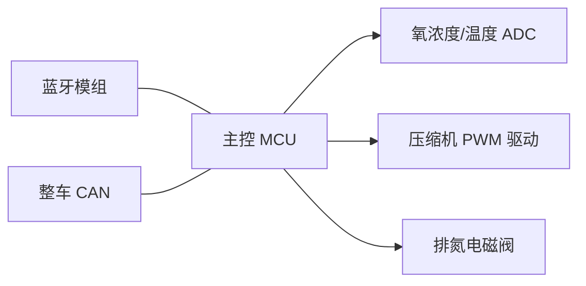
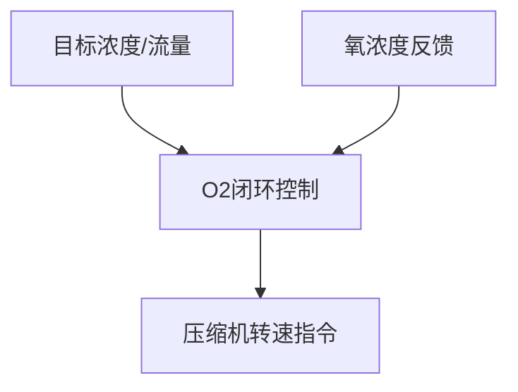

# 引言 Introduction

## 目标 Purpose
本文档描述多功能制氧机的软件功能需求、性能需求与接口需求，用于指导后续软件开发与验证。

## 范围 Scope
适用于多功能制氧机项目的软件需求开发。

# 产品总览 Product Overview

## 功能列表 Function list

| NO. | 一级功能模块 | 二级功能模块 | ASIL | 备注 |
|---|---|---|---|---|
| 1 | 制氧 | 浓度闭环、流量调节、4座开关 | 【TBD-待HARA】 | 源 SR-01-001 |
| 2 | 电源管理 | 休眠唤醒、掉电记忆 | 【TBD-待HARA】 | 源 SR-01-009 |

# 软件总体 Software Overall

## 软/硬件环境 Hardware / Software Context
下图为系统软硬件关联框图：

# 功能需求 Functional Requirements

## 功能 制氧管理 Feature O2 Management

### 功能关联 Feature Context

### 功能需求 Feature Requirements

| 需求ID | 标题 | 描述 | 类型 | 成熟度 | ASIL | 功能 | 验证标准 | 覆盖需求 | 发布计划 |
|---|---|---|---|---|---|---|---|---|---|
| HOD_SRS_O2_001 | 浓度闭环 | O2 管理模块应将氧浓度闭环控制在 ≥90% | Functional | Draft | 【TBD-待HARA】 | 制氧 | 稳态浓度≥90% | SR-01-001 | 【TBD】 |
| HOD_SRS_O2_002 | 流量调节 | O2 管理模块应支持 1~8L/min 流量可调 | Functional | Draft | 【TBD-待HARA】 | 制氧 | 各档流量误差≤±0.5L/min | SR-01-001 | 【TBD】 |
