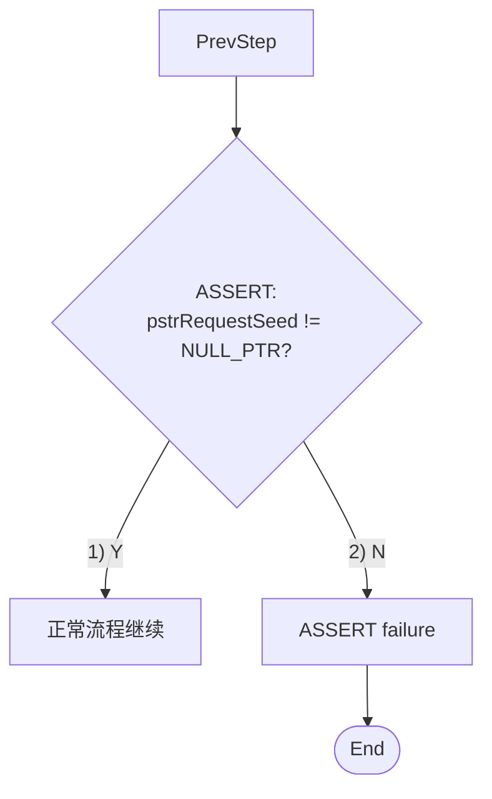

# SWDD Generator Skill

用于根据嵌入式模块源代码自动生成符合汽车电子行业ASPICE标准的软件详细设计文档。

## 强制规范（必读，不得违反）

**生成或修改任何 SWDD 前必须先阅读并遵守：** [references/SWDD_Mandatory_Requirements.md](references/SWDD_Mandatory_Requirements.md)

**核心约束摘要：**
1. **禁止简化**：不得使用 Same pattern、omitted for brevity、Details omitted 等概括替代具体内容。
2. **一一对应**：每个对外/对内接口、每张图须与源码一致。
3. **2.4 静态图**：须包含本模块全部对外接口及与 Callers/下层的连线；2.4.2 表与 2.7/2.8 一致无遗漏。
4. **2.6 动态图**：须为 PlantUML 序列图；调用链完整，不得越级。
5. **2.7/2.8**：每个函数必须有完整 Mermaid 流程图。
6. **流程图分支编号**：每个判断出边必须用编号+右括号标注，格式 `-->|"1) Y"|` / `-->|"2) N"|`，禁止裸的 `"Y"`/`"N"`。**同一流程图内的所有分支必须连续编号**。
7. **流程图代码语言**：流程图中处理框/判断框必须为实际代码，禁止自然语言或概括描述。
8. **流程图与源码一一对应（重要！）**：
   - 每个流程图必须与源代码逐行对应，不得简化或编造
   - 空函数就是空函数（只有`}`），不能添加任何虚构步骤
   - 变量名、函数调用、赋值语句必须与源码完全一致
   - 禁止添加源码中不存在的操作（如"Clr Alarm"、"Set Status"等泛化描述）
9. **函数分类**：
   - External函数：被外部模块实际调用
   - Internal函数：仅被本模块函数调用

### 编写流程图前的源码分析检查清单（必须逐项完成！）

**每个状态机状态（case）编写流程图前，必须先分析源码：**

```
源码分析模板：
case IS_XXX:
    // 1. 第一个if语句
    if(条件1) {
        操作A;
        操作B;
        return/break;  // ← 关键：是否有return/break？
    }

    // 2. 第二个if语句（独立if，非if-else）
    if(条件2) {        // ← 关键：是否与第一个if互斥？
        操作C;
        操作D;
        return/break;  // ← 关键：是否有return/break？
    }

    // 3. entry & during（赋值语句）
    赋值语句1;
    赋值语句2;

    // 4. 第三个if语句
    if(条件3) {
        操作E;
        return/break;  // ← 关键：是否有return/break？
    }
    break;
```

**关键判断规则：**
| 源码结构 | 流程图绘制 | 示例 |
|---------|-----------|------|
| if后有 **return** | 该动作节点 → 直接到End | ArmingToDisarmed → End |
| if后 **无return**，后面还有代码 | 该动作节点 → 继续连接到下一个检查 | ArmingToIntDiag → ArmingExit2Check |
| if-else（互斥） | Y分支和N分支都画，但不能同时存在 | 判断框有两个分支 |
| 两个独立if（非if-else） | 两个独立的检查路径，后续if的入口需要额外连接 | ArmingExit1 → ArmingToIntDiag → ArmingExit2Check |
| **ASSERT(条件)** | **必须作为判断分支**：Y分支继续正常流程，N分支连接到 "ASSERT failure" → End | 见下方 ASSERT 规则 |
| **switch-case** | **每个case和default分支都必须带编号**，格式 `-->\|"N) case值"\|`，编号与其他判断分支统一连续 | 见下方 switch-case 规则 |

### switch-case 分支必须全部编号（重要！）

**规则**：switch-case 语句在流程图中表示为判断菱形框，其所有分支（每个 case 值 + default）必须带编号，且与整个流程图的编号体系连续。

**错误做法**：
```mermaid
    SwitchAxis -->|"MC36XX_AXIS_X"| SetX["..."]
    SwitchAxis -->|"MC36XX_AXIS_Y"| SetY["..."]
    SwitchAxis -->|"default"| Next
```
问题：分支没有编号，且判断框文本不明确。

**正确做法**：
```mermaid
    SwitchAxis{"switch(axis)"}
    SwitchAxis -->|"1) MC36XX_AXIS_X"| SetX["_bRegData = 0x01"]
    SwitchAxis -->|"2) MC36XX_AXIS_Y"| SetY["_bRegData = 0x02"]
    SwitchAxis -->|"3) MC36XX_AXIS_Z"| SetZ["_bRegData = 0x03"]
    SwitchAxis -->|"4) default"| Next
```

**要点**：
- 判断框文本使用 `switch(变量名)` 格式，不能只写 `变量名?`
- 每个 case 值和 default 都必须有编号
- 编号与其他 if/else 判断分支连续递增（不单独编号）
- 即使 default 分支只是 break 不做任何事，也必须画出并编号

### ASSERT 必须作为流程图判断分支（重要！）

**规则**：源码中的 `ASSERT(条件)` 不是普通的赋值语句，它是一个**运行时检查**，必须在流程图中体现为判断菱形框，包含 Y/N 两个分支：
- **Y 分支**：条件成立，继续正常流程
- **N 分支**：条件不成立，进入 "ASSERT failure" 处理框 → End

**Mermaid 示例**：


**错误做法**：将 ASSERT 视为普通语句放在处理框中，或直接省略不画。
**正确做法**：将 ASSERT 作为判断菱形框，标注 `ASSERT:` 前缀 + 判断条件，Y/N 分支各有编号。

**验证命令**：
```bash
# 在源码中查找所有 ASSERT 调用
grep -n "ASSERT(" BBS_K311_APP/src/Source/APP/{模块名}/*_prg.c
# 在对应流程图中确认 ASSERT 作为判断框存在
grep -i "ASSERT" swdd/{模块名}/img/*_Flowchart.mmd
```

### 流程图禁止任何形式的简写/缩写（重要！）

**规则**：流程图中所有标识符、函数调用、条件表达式必须与源码**完全一致**，禁止任何形式的省略或缩写。

**禁止的简写模式：**

| 禁止模式 | 示例（错误） | 正确写法 |
|---------|------------|---------|
| `...` 省略前缀 | `Rte_Write_...BbsLpc7LinFr01_` | `Rte_Write_Cfg_Tx_LPCSystem_LPC7LIN_BbsLpc7LinFr01_` |
| `...` 省略中间路径 | `strFr02...int_mem_ok` | `strFr02.SoundrBattBackedDiag.bits.int_mem_ok` |
| `...` 省略函数参数 | `AesCmacVerify(key, ...)` | `AesCmacVerify(key, len, plain, &authLen, authData, OPT)` |
| `...` 省略中间调用 | `mc_read_regs(X_LSB) ... mc_read_regs(Z_MSB)` | 逐个列出全部6次调用 |
| 范围简写 | `Nr1..Nr4`, `[0..3]`, `u8Index1..7` | 逐个列出每次赋值/调用 |
| 概括性描述 | `Any digit > 0x09?` | `serialUnits > 0x09 \|\|<br/>serialTens > 0x09 \|\|<br/>serialHundreds > 0x09 \|\|<br/>serialThousands > 0x09?` |
| 描述性过程 | `Validate serial BCD digits` | 逐行列出实际的变量提取代码 |
| 半条件省略 | `X < MIN \|\| > MAX` | `X < MIN \|\| X > MAX`（两侧都写完整变量） |

**验证命令**：
```bash
# 检查流程图中是否存在简写
grep -n '\.\.\.' swdd/{模块名}/img/*_Flowchart.mmd
# 应该无输出。如果有 "..." 就是简写。
```

**原因**：详设文档是代码审查和测试的基准，简写会导致：
1. 审查人员无法确认是否与源码一致
2. 测试人员无法依据流程图编写完整测试用例
3. 后续维护时无法判断简写代表的具体内容

### 死代码必须排除（重要！）

**规则**：以下三类"死代码"中的函数**禁止写入 SWDD 文档**的任何位置（静态图、总览表、动态图、函数详设）：

**三类死代码：**

| 类型 | 定义 | 示例 |
|------|------|------|
| 1. 条件编译未启用 | `#ifdef MACRO` 块内且该宏未 `#define`；`#if 0` 块内 | `#ifdef DMEM_FLS_FUNCTION_ENABLE` 包裹的 `DMEM_u8BlankCheck` |
| 2. 代码被注释 | 函数体、extern 声明或调用处被 `//` 或 `/* */` 注释掉 | `// extern void ADESC_vidDisable48VOptRsnInit()` |
| 3. 定义了但无调用方 | 函数存在于 .c 文件中，但整个项目中无任何地方调用它 | `DESC_vidStorNewRsn` 唯一调用被注释掉；`DESC_u32SwitchU32` 唯一调用方在未编译的 `#ifdef` 块中 |

**检查步骤**：

**类型1 - 条件编译未启用：**
```bash
# 查找源码中所有 #ifdef / #if 0 块
grep -n "#ifdef\|#ifndef\|#if 0" BBS_K311_APP/src/Source/{层}/{模块名}/*.[ch]
# 检查每个宏是否在项目中定义
grep -r "#define 宏名" BBS_K311_APP/
```

**类型2 - 代码被注释：**
```bash
# 查找 int.h 中被注释掉的 extern 声明
grep -n "//.*extern" BBS_K311_APP/src/Source/{层}/{模块名}/*_int.h
```

**类型3 - 定义了但无调用方（最重要！）：**
```bash
# 对每个函数，在整个项目中搜索调用方
grep -rn "函数名" BBS_K311_APP/src/ BBS_K311_APP/MCAL/ --include="*.c"
# 注意：必须追踪完整的 RTE 宏链！
# 例如 HPWM_vidPwmInit → DRTE_vidPwmInit → HRTE_vidPwmInit → SRTE_vidPwmInit → SMIC_vidPwmInit
# 只有链条末端的宏在某个 .c 文件中被调用，才算有调用方
# 仅在注释中出现不算调用（如 //DESC_vidStorNewRsn(u8FaultData);）
```

**注意**：
- 始终编译的函数（`#ifdef` 块外面的）且有调用方的正常写入
- RTE 宏链（DRTE→HRTE→SRTE→SMIC）必须追踪到底，不能只看直接调用

### 静态图必须展开所有函数，禁止通配符分组（重要！）

**规则**：2.4.1 Static Diagram 中必须列出**每一个**函数的独立节点，禁止使用通配符（`*`）或分组简写。

**禁止的简写模式：**

| 禁止模式 | 示例（错误） | 正确写法 |
|---------|------------|---------|
| 通配符分组 | `ADESC_vidReadDid_*` | 逐个列出每个 ReadDid 函数节点 |
| 斜杠分组 | `ADESC_vid/u16 SupplierID/FunctionID` | 分别列出 vidSetSupplierID, u16GetSupplierID, vidSetFunctionID, u16GetFunctionID |
| 范围分组 | `ADESC_bolLinDrv*Flg` | 逐个列出每个 LinDrv 标志函数 |

**正确做法**：
- 静态图节点数量必须与 2.4.2 Component Overview Table 的函数数量一致
- 用 `subgraph` 按功能分组保持可读性（如 "DID Read (FD00-FD09)"、"LIN Driver Flags" 等）
- 外部调用方应精确标注（如 `Rte.c`、`LinIf`、`SMIC` 等），不要用模糊的 "DCM" 或 "LIN Driver"
- 通过 SRTE 宏映射的调用应标注 `(via SRTE)`

**验证命令**：
```bash
# 检查静态图是否有通配符
grep '\*\|\.\.\./' swdd/{模块名}/img/*Static_Diagram*.mmd
# 应该无输出
# 对比函数数量
grep -c '^\|' swdd/{模块名}/BBS_K311_APP_*_EN.md | head -5  # 表格行数
grep -c '"\w' swdd/{模块名}/img/*Static_Diagram*.mmd  # 节点数
```

### 经验教训：赋值语句不重复原则 ⚠️

**问题描述**：在状态机流程图中，entry/during阶段的赋值语句（如设置LIN信号）只在状态开始时执行一次。Stay节点表示"所有条件都不满足后break"，不应该再包含已执行过的赋值语句。

**错误示例**：
```
源码:
case IS_ARMING:
    strBbsLpc7LinFr02.SoundrSnsrInclnArmSts = AlrmSts_DisarmedArming;  // entry赋值，只执行一次
    if(exit1条件) { ... }
    if(exit2条件) { ... }  // 两个独立if
    break;

错误流程图:
    ArmingSetStatus[...] --> ArmingExit1  (包含赋值语句 ✓)
    ArmingExit2Check -->|"12) N"| ArmingStay["strBbsLpc7LinFr02..."]  (错误！重复赋值)

正确流程图:
    ArmingExit2Check -->|"12) N"| ArmingStay[Remain in IS_ARMING]  (正确！不重复赋值)
```

**验证命令**：
```bash
# 检查Stay节点是否包含赋值语句（应该只有"Remain in XXX"）
grep 'Stay\[' swdd/{模块名}/img/*.mmd
# 正常应该全部是: Stay[Remain in XXX]
```

**验证方法：编写完流程图后，必须执行以下检查：**
```bash
# 检查所有连接到End的节点，确认它们只有一条出边
grep '\-\-> End' swdd/{模块名}/img/*.mmd | sed 's/:[[:space:]]*/ /' | sed 's/[[:space:]]*\-\-> End.*//' | sort -u | while read node; do
  total=$(grep "^    ${node} \-\-> " swdd/{模块名}/img/*.mmd 2>/dev/null | wc -l)
  if [ "$total" -gt 1 ]; then
    echo "ERROR: $node has $total outgoing edges but connects to End!"
  fi
done
```

---

## 文档结构（必须严格按此格式）

```
1 Overview
    1.1 Purpose
    1.2 Scope
    1.3 Reader
    1.4 Reference
    1.5 Terminology and Abbreviation

2 {模块名} Component Design
    2.1 Component Introduction
    2.2 Main Function Description
    2.3 Component Files
    2.4 Static Diagram
        2.4.1 Static Diagram Picture
        2.4.2 Component Overview Table
    2.5 Data Design
        2.5.1 Global Data
        2.5.2 Data Structure
        2.5.3 Enum
        2.5.4 Constant
        2.5.5 Calibration
    2.6 Dynamic Behavior
    2.7 External Function
        2.7.1 {函数1}
        2.7.2 {函数2}
        ...
    2.8 Internal Function
        2.8.1 {函数1}
        2.8.2 {函数2}
        ...

3 Appendix
    3.1 Design Methods
    3.2 Design Guidelines
    3.3 Traceability and Consistency Requirements
    3.4 Unit Verification Criteria
```

---

## 快速开始

1. 获取模块源代码（.c/.h文件）
2. 分析代码中的函数、变量、调用关系
3. 按照模板结构填写各章节内容
4. 验证所有函数调用关系的正确性

---

## 各章节详细要求

### 1.1 Purpose（目的）

模板格式（`{模块名}` 替换为实际模块名）：
```
The purpose of this document is to explain the results of detailed design of {模块名} software, and provide input for unit construction by defining the internal structure, interface and dynamic behavior of components.
```

### 1.2 Scope（范围）

固定格式：
```
This strategy is applicable to the detailed design of BBS_P519_V436 project software, including the unit design of all software in all stage.
```

### 1.3 Reader（读者）

固定格式，使用编号列表：
```
1) Software developers
2) Software Testers
3) Software architects
4) QA and Assessor
```

### 1.4 Reference（参考文档）

表格格式：
```
| No. | References | Version |
|-----|------------|---------|
| 1 | BBS_P519_V436 project BBS product software requirement specification | Latest version |
| 2 | BBS_P519_V436 project BBS product software architecture design specification | Latest version |
```

### 1.5 Terminology and Abbreviation（术语和缩写）

分两个表格：

**1.5.1 Terms（术语定义）：**
```
| NO. | Terms | Definition |
|-----|-------|------------|
| 1 | BBS | Battery Backed-up System |
| 2 | LIN | Local Interconnect Network |
```

**1.5.2 Abbreviations（缩写说明）：**
```
| Abbreviations | Full spelling | Notes |
|---------------|---------------|-------|
| {模块名} | {全称} | {说明} |
```

---

### 2.1 Component Introduction（组件简介）

简要描述模块的主要职责和在系统中的作用。一段话即可。

### 2.2 Main Function Description（主要功能描述）

列出模块的主要技术要点和实现方法，使用编号列表：
```
Main technical points and implementation methods of the {模块名} module:

1. {功能点1}: {简要描述}
2. {功能点2}: {简要描述}
```

### 2.3 Component Files（组件文件）

**重要：文件清单必须通过遍历模块目录下的实际文件生成！**

表格格式：
```
| No. | Filename | Description |
|-----|----------|-------------|
| 1 | {模块名}_prg.c | The implementation of the component's function. c file, containing definitions of all the functions that the module implements. |
| 2 | {模块名}_int.h | The external interface header file, declaring functions and types that are exposed to other modules. |
| 3 | {模块名}_priv.h | The private header file, containing internal declarations used only within this module. |
| 4 | {模块名}_cfg.h | The configuration header file, containing module-specific configuration macros and constants. |
| 5 | {模块名}_cfg.c | The configuration source file, containing module-specific configuration data. |
```

---

### 2.4 Static Diagram（静态图）

#### 2.4.1 Static Diagram Picture

**插入Mermaid源码**（不是PNG图片），包含以下子图：
- **External Modules**：调用本模块的外部模块
- **Module External Functions**：本模块的外部接口函数
- **Module Internal Functions**：本模块的内部函数
- **Lower Modules**：本模块调用的下层模块

**语法要求**：
- 开始/结束节点：使用 `Start([Start])` / `End([End])`

**关键要求：**
- 通过grep搜索确认每个函数的调用者
- 移除死代码（空函数、未被调用的函数）
- 外部模块必须与本模块函数有连线
- **双向检查**：外部模块→本模块，本模块→外部模块
- **宏定义函数必须追踪完整调用链（重要！）**：
  - 如果函数是宏定义（如 `#define HPWM_vidPwmInit DRTE_vidPwmInit`），必须沿 RTE 宏链向上追踪到实际调用者
  - 追踪路径：DRTE→HRTE→SRTE→SMIC_cfg.h→SMIC_prg.c（或其他实际调用点）
  - 静态图中必须画出"实际调用者 --> 宏函数"的连线
  - 示例：`SMIC_vidPwmInit()` → `SRTE_vidPwmInit` → `HRTE_vidPwmInit` → `HPWM_vidPwmInit`，静态图中画 `SMIC --> vidPwmInit`
  - **不能因为函数是宏就省略上游调用连线**

#### 2.4.2 Component Overview Table

```
| Component ID | Unit ID | Unit name | External/Internal Function | SW unit description | ASIL level |
|--------------|---------|-----------|---------------------------|-------------------|------------|
| {模块名} | {模块名}_unit_01 | 函数名 | External | 功能描述 | QM |
```

- Unit ID连续（unit_01, unit_02...）
- 与2.4.1和2.7/2.8一致

---

### 2.5 Data Design（数据设计）

#### 2.5.1 Global Data（全局数据）

**只列出本模块定义的全局/静态变量**

表格格式：
```
| Name | Scope | Type | Range | Unit | Accuracy | Error | Offsets | Initial | Description |
|------|-------|------|-------|------|----------|-------|---------|---------|-------------|
```

- Scope：extern（全局）或static（静态）
- Unit列：只有物理单位才填（s/ms/A/V等），计数值填`-`

#### 2.5.2 Data Structure（数据结构）

只列出本模块定义的结构体，**不是本模块使用的**

表格格式：
```
| Data Type | Member | Description |
|-----------|--------|-------------|
| **StructName** | type member1 | Description |
| | type member2 | Description |
```

#### 2.5.3 Enum（枚举）

只列出本模块定义的枚举

表格格式：
```
| Enum Name | Member | Value | Description |
|-----------|--------|-------|-------------|
| **EnumName** | ENUM_A | 0 | Description |
| | ENUM_B | 1 | Description |
```

#### 2.5.4 Constant（常量）

- 宏定义常量（#define数值）
- const变量

表格格式：
```
| Name | Value | Description |
|------|-------|-------------|
| CONST_NAME | 100 | Description |
```

#### 2.5.5 Calibration（标定参数）

固定内容：
```
Reference to "BBS_SPA3 Calibration Parameter Table"
```

---

### 2.6 Dynamic Behavior（动态行为）

**必须插入PlantUML源码**（不是PNG图片）

⚠️ **禁止使用 `` 格式插入动态图，必须使用代码块嵌入PlantUML源码**

**⚠️ 重要：函数调用完整性要求**
- **必须逐行扫描本模块的 `*_prg.c` 源文件**
- 确保所有函数调用（对外部模块、内部函数、下层BSW的调用）都要体现在动态图中
- 不能遗漏任何实际被编译执行的函数调用
- **宏定义的External函数也必须在动态图中体现（重要！）**：
  - 如果函数通过宏链被外部模块调用（如 SMIC → SRTE → HRTE → HPWM_vidPwmInit），动态图中必须画出该调用
  - 检查方法：遍历 Component Overview Table 中所有 External 函数，逐一确认每个函数在动态图中都有对应的调用场景
  - 特别注意 Init/DeInit 类宏函数，它们通常在 System Initialization 阶段被调用，容易遗漏

**⚠️ 忽略未被编译的代码**
- 条件编译 `#if`、`#ifdef`、`#ifndef` 等不生效的分支不需要体现
- 只体现实际会被编译执行的代码路径

**Legend（表格格式，放在图上方）：**
```
| Color | Description |
|-------|-------------|
| Blue (#a8d4ff) | 本模块外部函数 |
| Green (#98FB98) | 本模块内部函数 |
| Yellow (#FFEB99) | 外部模块函数 |
```

**节点要求：**
- 本模块所有External + Internal函数（与2.4.2组件表一致）
- 外部模块函数（调用本模块的 + 本模块调用的）

**箭头标签规则：**
- 外部模块→本模块：写**调用者函数名**
- 本模块内部调用：写**调用者的形参**（无形参则不写）
- 本模块→外部模块：写**被调用者函数名**

**状态分隔符：** `== 状态名 ==`

**生命周期（activate/deactivate）要求：**
- 每个被调用函数必须有 `activate` 和 `deactivate` 标记其生命周期
- activate 放在函数被调用后，deactivate 放在函数返回前
- 外部模块调用本模块时，本模块函数需要 activate/deactivate
- 本模块调用内部函数或下层模块时，被调用者需要 activate/deactivate
- ⚠️ **特别注意**：主函数（如 AINCU_vidMainFunction）的生命周期必须贯穿整个状态机，不能在中间某个状态后就结束！deactivate 应该在整个函数执行完毕后才出现
- ⚠️ **不要使用 `return` 关键字**：PlantUML 的 return 会终止整个生命周期，导致后续状态无法显示
- ✅ **void函数返回规则（重要！）**：
  - 如果被调用函数的返回类型是 **void**，**不需要画返回箭头**
  - 例如：`HRTE_vidSetPortHBridge_NSleep()` 是 void 函数，调用时只需 `activate` / `deactivate`，不需要 `--> return`
  - 只有**非void函数**（有返回值）才需要画返回箭头
- ⚠️ **同一状态内的多个条件分支必须使用 `alt/else/end` 结构**，不能使用多个独立的 `alt/end`，否则会导致生命周期线显示不正确
- ⚠️ **不要把数据数组误认为外部模块**：例如 "Calibration" 通常只是从 Calibration_Data_Array 读取数据的内部操作，不是外部模块。必须通过 grep 源代码确认是否有实际的外部模块调用
- 示例：
  ```
  MainFunc -> IntDiag :
  activate IntDiag
  IntDiag -> HRTE : HRTE_vidXxx()
  activate HRTE
  HRTE --> IntDiag : return
  deactivate HRTE
  deactivate IntDiag
  ```

**PlantUML换行符规则（重要！）：**
- PlantUML 序列图中的消息标签换行必须用 `\n`，**禁止使用 `<br/>`**
- `<br/>` 在 PlantUML 中会被当作纯文本渲染出来
- Mermaid flowchart 中换行仍使用 `<br/>`（Mermaid 语法正确支持）
- 示例：`A -> B : funcName(param1,\nparam2,\nparam3)` ✅
- 错误：`A -> B : funcName(param1,<br/>param2,<br/>param3)` ❌

**PlantUML样式设置（必须在图开头添加）：**
```
@startuml
skinparam backgroundColor #FFFFFF
skinparam participantPadding 10
skinparam boxPadding 10
skinparam sequenceArrowThickness 2
skinparam roundcorner 10
...
```

**⚠️ 强制检查清单（必须完成所有项才能编写动态图）：**

- [ ] 已完整阅读源文件 `*_prg.c`（从第一行到最后一个函数）
- [ ] 已识别所有状态机（switch-case语句）的所有case分支
- [ ] 已识别所有if-else if-else条件分支
- [ ] 已对照每个状态/分支的实际代码，列出所有函数调用及位置（行号）
- [ ] 已忽略 `#if`/`#ifdef` 条件编译中不生效的代码
- [ ] 已将所有实际调用的函数添加到动态图中
- [ ] 已确保每个被调用者都有对应的 activate/deactivate 标记
- [ ] 已交叉验证：动态图中的调用与源代码一一对应
- [ ] **已验证函数调用关系**：特别检查内部函数（如bbs_func）是否有错误调用
  - 如果调用链是：MainFunc → SRTE获取参数 → MainFunc → bbs_func(参数)
  - 动态图中应体现为：MainFunc → SRTE → MainFunc → bbs_func
  - **不能错误画成**：MainFunc → bbs_func → SRTE（这样就变成了bbs_func调用SRTE）
  - 检查方法：在源码中确认参数是调用者获取后传入的，还是被调用者内部获取的

**⚠️ 特别注意：**
- **switch-case**：每个case分支都要单独体现，包括所有代码路径
- **if-else if-else**：每个分支都要单独体现，不能遗漏
- **嵌套结构**：嵌套的if/switch内部的所有调用都要体现

**函数调用提取步骤：**
1. 打开本模块的 `*_prg.c` 源文件
2. **从头到尾完整阅读一遍**，理解整体逻辑
3. 找到所有状态机（switch-case），标记每个case
4. 对每个case，逐一检查内部的if-else if-else分支
5. 对每个if/else分支，记录其中的所有函数调用（包括行号）
6. 将所有函数调用按状态/分支添加到动态图中
7. 确保每个被调用者都有对应的 activate/deactivate 标记
8. **完成后再次对照源代码检查是否有遗漏**

---

### 2.7 External Function（外部函数）

每个External函数一个章节（2.7.1, 2.7.2...）

**函数属性表：**
```
| Attribute | Value |
|-----------|-------|
| Prototype | void func(void) |
| Location | xxx.c |
| Function Description | 功能描述 |
| Complexity | 1-5 |
| Importance | 1-5 |
| Priority | (计算值) |
| Verification Criteria | Unit Test |
```

**Parameters：**
- 无参数：`No input parameters and no return value`
- 有参数：列出参数表

**Mermaid流程图语法（必须遵守）：**

- **开始/结束节点**：使用圆角矩形 `Start([Start])` / `End([End])`
  - ❌ 错误：`Start((Start))`、`End((End))`
  - ✅ 正确：`Start([Start])`、`End([End])`

- **分支编号格式**：`-->|"1) Y"|`、`-->|"2) N"|`
  - **统一格式**：只使用 `数字+右括号+Y/N` 格式（如 `1) Y`、`2) N`、`3) Y`、`4) N`），禁止使用圆圈数字（如 ①②③）
  - **连续编号**：同一流程图内的所有分支必须连续编号（1→2→3→4...），每个判断的Y/N分支接着上一个判断的编号
  - 示例：
    - 第1个判断：Y分支编号 `1) Y`，N分支编号 `2) N`
    - 第2个判断：Y分支编号 `3) Y`，N分支编号 `4) N`
    - 以此类推...

- **代码表达式要求（重要！）**：
  - ✅ 必须使用完整的代码表达式，与源码逐行对应
  - ❌ 禁止使用自然语言或简化描述（如"Get flag"、"Reset timer"、"Check status"）
  - ✅ 使用完整变量名：`bAccelerationChangeFlagLoc`（不是`bFlag`）
  - ✅ 使用完整函数名：`HRTE_bGetAccelerationChangeFlag()`（不是`GetFlag`）
  - ✅ 使用完整赋值表达式：`u16PeriodTime += AINCU_u8TASK_PERIOD_MS`
  - ✅ 使用完整函数调用：`as16InclineAngleNew[MC36XX_AXIS_X] = HRTE_s16GetInclineAngle(MC36XX_AXIS_X)`

- **双引号使用规则（重要！）**：
  - Mermaid节点文本中如果包含方括号 `[]`、圆括号 `()`、花括号 `{}`、大于小于号 `<>` 等特殊字符，**必须用双引号包裹**
  - 示例：
    - ✅ `["bAccelFlag = HRTE_bGetAccelFlag()"]` - 圆括号需要双引号
    - ✅ `["arr[i] = func(x)"]` - 方括号和圆括号需要双引号
    - ✅ `{arr[i] > threshold?}` - 判断框中方括号需要双引号
    - ❌ `[arr[i] = func(x)]` - 没有双引号会导致解析错误
  - **注意**：一旦某个节点使用了双引号，其他有特殊字符的节点也必须用双引号，否则会导致渲染不一致

- **长文本换行规则（重要！）**：
  - **触发条件**：当节点内文本（矩形框 `[]` 或菱形框 `{}`）超过约 **23个字符** 时，需要换行
  - **拆分位置**：在以下逻辑边界处换行
    - `.` (成员访问符)：`obj.member1.member2` → `obj.member1.<br/>member2`
    - `||` / `&&` (逻辑运算符)：`cond1 || cond2` → `cond1 ||<br/>cond2`
    - `==` / `!=` / `>` / `<` (比较运算符)：长条件表达式可在运算符处换行
  - **拆分示例**：
    - 矩形框：`["strBbsLpc7LinFr02.SoundrSnsrInclnArmSts = AlrmSts_Disarmed<br/>INCU_vidExitIsDisarmed()"]`
    - 菱形框：`{AINCU_strRxLpcLpc7LinFr01.<br/>SoundrSnsrInclnArmCmd<br/>== ArmReq_Disarm?}`
  - **注意事项**：
    - 必须与源码一致，不能自行简化变量名、函数名、表达式

- **变量声明**：在Start后添加LocalVar节点，列出所有局部变量
  - 示例：`LocalVar["u16PeriodTime, u8AlarmRetryCnt, bAccelFlagLoc, u8IndexTire"]`

- **判断框**：使用完整的条件表达式
  - 示例：`CheckPeriod{"u16PeriodTime >= AINCU_u16ANGLE_DETECTION_PERIOD_MS?"}`

**Figure编号 + Process Description**

---

### 2.8 Internal Function（内部函数）

格式同2.7

---

### 3 Appendix（附录）

**3.1 Design Methods**
```
It is recommended to use the following tools for static block diagrams, interface information (block definition diagrams and internal block diagrams in SysML), dynamic interactions (sequence diagrams, activity diagrams, state machines in SysML), and Simulink modeling for unit construction.
```

**3.2 Design Guidelines**
```
The coding specification adopts the "Coding Specification for Handwritten Code (C Language)" compiled by Shenzhen H&T Automotive Electronics Technology Co., Ltd.
```

**3.3 Traceability and Consistency Requirements**
```
Establish bidirectional traceability relationships between software architecture elements and software detailed design units through Rectify. The above linking relationships are implemented through model/code names and IDs of software detailed design units.

**Consistency Requirements:**
- Linking relationships: The links described in the above traceability relationships are available and correct
- Version matching: The versions of reviewed software requirements specifications, architecture design specifications, detailed design specifications, models, and code are correct and match
```

**3.4 Unit Verification Criteria**
```
| Verification Method | Verification Description | Success Criteria |
|--------------------|------------------------|------------------|
| Static Analysis | Use Polyspace static analysis tool for static analysis | All issues found by static analysis are fixed, or sufficient justification is provided for unfixed issues |
| Code Review | Organize code review meetings based on code review checklist items | All issues found in review are fixed, review passed |
| Dynamic Testing | Use Tessy tool for unit testing | Statement Coverage 100%, Branch Coverage 100% |
```

**注意：不需要 Document Revision History 部分**

---

## 关键检查清单

### 函数分类检查
- [ ] External函数：被外部模块实际调用
- [ ] Internal函数：仅被本模块函数调用
- [ ] 死代码：未被调用或空函数（需移除）

### 调用关系检查
- [ ] 使用grep确认每个函数的实际调用者
- [ ] 明确写出具体模块名，不用"其他模块"等模糊表述

### 图表检查
- [ ] **Mermaid语法正确**
- [ ] **Mermaid源码语法检查（必做）**：
  - `flowchart TD` 或 `flowchart TB` 前不能有多余空格（必须是行首）
  - 开始/结束节点必须使用 `Start([Start])` / `End([End])`，不能是 `Start((Start))` / `End((End))`
  - 代码块必须使用 ` ```mermaid` 标记，不能缺少反引号
- [ ] **2.4 静态图必须嵌入Mermaid源码**（禁止使用PNG：``）
- [ ] **2.6 动态图必须嵌入PlantUML源码**（禁止使用PNG：``）
- [ ] **流程图分支编号（必做）**：所有判断出边必须为 `-->|"1) Y"|` / `-->|"2) N"|` 等形式，且连续编号
- [ ] **流程图代码语言（必做）**：仅使用实际代码表达式，禁止自然语言或简化描述
- [ ] **流程图双引号使用（必做）**：节点文本中包含 `[]` `()` `{}` `<>` 等特殊字符时必须用双引号包裹
- [ ] **流程图完整变量名（必做）**：使用与源码一致的完整变量名和函数名，不能简化
- [ ] **流程图与源码一致（必做）**：判断条件、调用顺序、返回值与 `*_prg.c` 一致
- [ ] **流程图嵌套结构检查（必做）**：
  - 必须对照源代码逐行检查流程图
  - 特别注意if-else if-else嵌套结构：每个分支都要完整体现
  - 检查else分支是否遗漏：例如 if(A) { if(B) {...} } else { ... } 结构，else分支也要正确连接
  - 检查嵌套if后是否还有后续代码：嵌套if结束后可能还有后续操作
  - **特别注意独立if vs if-else**：
    - 独立if：两个或多个if语句依次执行，每个if都会被检查，可能同时触发（如IS_ARMING状态的exit1和exit2）
    - if-else：互斥结构，只能选择其中一个分支执行（如IS_ARMING_INT_DIAG状态的else-if）
    - 流程图中独立if要体现为多个独立的检查路径，if-else要用互斥结构表示
    - **常见错误**：在独立if的Y分支执行完后，错误地再画一条线连接到下一个判断节点。正确做法是每个if有自己独立的分支输出（如IS_ARMED状态有两个独立的if：第一个if判断结果，第二个if判断命令，两者都会执行）
    - 验证方法：检查从判断节点出来的分支是否都有对应的编号（如 `41) Y` 和 `42) N`），如果某个分支后面多了一条无编号的线连接下一个节点，说明画错了
  - **特别注意每个判断分支的输出数量**：
    - if判断：必须有且只有两个输出（Y和N）
    - switch判断：可以有多个输出（case1、case2、default等）
    - 不能遗漏任何一个分支的输出
    - 示例：错误做法 `判断 --> "Y" ...`（缺少N分支）；正确做法 `判断 --> "1) Y" ... 判断 --> "2) N" ...`
  - **特别注意编号连续性**：
    - 每个判断节点的Y和N分支必须使用**连续编号**（如39) Y和39) N）
    - 编号不能重复使用：一个编号只能用于一个判断节点的一对输出
    - 添加新分支时，必须使用下一个可用编号
    - **自检验证命令**：`grep -oE '\|"[0-9]+\) [YN]' file.mmd | sort` 检查是否有重复编号
  - **特别注意判断节点的上游连接**：
    - 判断节点（菱形框）的上游可以是矩形框（处理框）或其他判断节点
    - 独立if场景：两个独立的if语句都可能连接到同一个判断节点（如IS_ARMED状态中，UnauCheck的N分支和ArmedToTriggered都指向ArmedDisarmCheck）
    - 这是正确的，因为两个独立if会依次执行
  - **特别注意矩形框（动作框）不能有两条分支**：
    - 矩形框（动作框 `[]`）表示执行某个动作，只有一条输出
    - **常见错误**：把矩形框画成有两条分支（如 `ArmedToTriggered --> End` 和 `ArmedToTriggered --> ArmedDisarmCheck`）
    - 矩形框如果需要连接到两个不同的后续节点，说明画错了，应该检查源码逻辑
    - **验证方法**：
      - `grep -n '\[.*\] --> ' swdd/{模块名}/img/*.mmd` 查看矩形框的出边数量
      - 正常情况：矩形框只有一条出边连接到下一个节点
      - 如果矩形框有两条出边，需要检查是否错误地将两个独立if画成了if-else
      - 独立if的正确画法：第一个if的Y分支执行完后，需要额外一条线连接到第二个if的入口（如 `ArmedToTriggered --> ArmedDisarmCheck`），但这是**从第一个if的矩形框连接到第二个if的判断框**，而不是矩形框本身有两条分支
- [ ] **ASSERT 必须作为判断分支（必做）**：
  - 源码中的 `ASSERT(条件)` 必须在流程图中体现为判断菱形框
  - 判断框文本格式：`ASSERT:<br/>条件表达式`
  - Y 分支：条件成立，继续正常流程
  - N 分支：连接到 `ASSERT failure` 处理框 → End
  - 验证命令：`grep -n "ASSERT(" *_prg.c` 对照 `grep -i "ASSERT" *_Flowchart.mmd`
- [ ] **switch-case 分支必须全部编号（必做）**：
  - 每个 case 值和 default 都必须有编号，格式 `-->|"N) case值"|`
  - 判断框文本使用 `switch(变量名)` 格式
  - 编号与 if/else 判断分支统一连续递增
  - 验证命令：`grep -E '-->\|"[^0-9]' swdd/{模块名}/img/*_Flowchart.mmd`（应无输出）
- [ ] **禁止任何形式的简写/缩写（必做）**：
  - 禁止 `...` 省略前缀、参数、中间调用
  - 禁止范围简写如 `Nr1..Nr4`、`[0..3]`、`u8Index1..7`
  - 禁止概括性描述如 `Any digit > 0x09?`、`Validate BCD digits`
  - 禁止半条件省略如 `< MIN || > MAX`（两侧都要写完整变量名）
  - 验证命令：`grep -n '\.\.\.' swdd/{模块名}/img/*_Flowchart.mmd`（应无输出）
- [ ] **条件编译函数必须排除（必做）**：
  - 扫描源码中 `#ifdef` / `#ifndef` / `#if 0` 块
  - 检查宏是否在项目中 `#define`，未定义则块内函数不得写入文档
  - 验证命令：`grep -n "#ifdef\|#ifndef\|#if 0" BBS_K311_APP/src/Source/{层}/{模块名}/*.[ch]`
  - 对每个宏：`grep -r "#define 宏名" BBS_K311_APP/`（无输出 = 未定义 = 排除）
- [ ] **流程图不得简化或编造（必做）**：
  - 必须对照源代码逐行检查流程图
  - 空函数就是空函数，不能添加虚构步骤
  - 变量名、函数调用、赋值必须与源码完全一致
  - 禁止添加源码中不存在的操作
- [ ] **img 目录完整性**：每个模块的 `img/` 目录下必须包含所有静态图、动态图、以及每个外部/内部函数的流程图文件
- [ ] 图表下方有编号（Figure 2-X-X）
- [ ] 图表下方有Process Description

### 动态图箭头标签验证引擎（重要！）

**⚠️ 生成动态图后，必须执行此验证！**

**规则：PlantUML序列图箭头标注必须与源代码一致：**
- `上游模块 -> 本模块函数 : 上游模块的调用函数名`
- `本模块函数 -> 下游模块 : 下游模块的被调用函数名`
- `本模块函数A -> 本模块函数B : 形参（若无则不标注）`

**自动验证步骤：**

```bash
# 1. 提取PlantUML中的所有箭头标注
grep -E "^[^:]+ -> [^:]+ :" swdd/{模块名}/img/{模块名}_Dynamic_Behavior.puml > /tmp/arrows.txt

# 2. 对每个"上游模块 -> 本模块函数"，验证冒号后的函数名属于上游模块
# 例如：ABBSM -> GetAngle : ABBSM_vidMainFunction()
# 需要验证：ABBSM_prg.c 中确实调用了 AINCU_enuGetAngleDetRes，且是在 ABBSM_vidMainFunction 中
```

**手动验证清单（必须逐项检查）：**

| 箭头类型 | 示例 | 验证方法 |
|---------|------|---------|
| 上游→本模块 | `AMSG -> GetWorkSta : MSG_vidLinSleepThread()` | grep AMSG目录，确认调用了AINCU_enuGetIsWorkSta |
| 本模块→下游 | `MainFunc -> HRTE : HRTE_vidSetPortHBridge_NSleep()` | grep HRTE目录，确认此函数存在 |
| 本模块内部 | `MainFunc -> InitPwr :` | grep 本模块，确认InitPwr被MainFunc调用 |

**常见错误：**
1. ❌ 错误：`ABBSM -> GetAngle : AINCU_enuGetAngleDetRes()`
   - 原因：标注的是本模块的函数名，而不是上游模块的函数名
   - ✅ 正确：`ABBSM -> GetAngle : ABBSM_vidMainFunction()`

2. ❌ 错误：`MainFunc -> HRTE : SetPort`
   - 原因：使用了缩写而非完整函数名
   - ✅ 正确：`MainFunc -> HRTE : HRTE_vidSetPortHBridge_NSleep()`

3. ❌ 错误（内部函数调用外部模块）：`HasFault -> SRTE : SRTE_enuGetBattLowVolErrSta()`
   - 原因：内部函数（如BBSM_bHasVoltageFault、BBSM_bIsInternalTriggerActive）本身不调用任何外部函数
   - 正确做法：**参数由调用者（MainFunc）获取，然后传给内部函数**
   - ✅ 正确：`MainFunc -> SRTE : SRTE_enuGetBattLowVolErrSta()` → 获取参数
   - ✅ 正确：`MainFunc -> HasFault : enuBattLowVolt` → 传入参数给内部函数

4. ❌ 错误（内部函数调用外部模块）：`IsIntTrg -> AMSG : AMSG_enuGetToutFlgLpcLpc7LinFr01()`
   - 原因：BBSM_bIsInternalTriggerActive只是接收参数检查，不调用AMSG
   - ✅ 正确：`MainFunc -> AMSG : AMSG_enuGetToutFlgLpcLpc7LinFr01()` → MainFunc获取enuTimeoutSts
   - ✅ 正确：`MainFunc -> IsIntTrg : enuTimeoutSts` → MainFunc传给IsIntTrg检查

**验证脚本（自动执行）：**

```bash
#!/bin/bash
# verify_arrow_labels.sh - 验证动态图箭头标签

MODULE=$1
PUML_FILE="swdd/${MODULE}/img/${MODULE}_Dynamic_Behavior.puml"
SRC_DIR="BBS_K311_APP/src/Source/APP"

if [ ! -f "$PUML_FILE" ]; then
    echo "Error: $PUML_FILE not found"
    exit 1
fi

echo "=== 验证动态图箭头标签 ==="
echo ""

# 提取所有箭头
arrows=$(grep -E "^[^:]+ -> [^:]+ : .+" "$PUML_FILE")

# 对每一行箭头进行验证
echo "$arrows" | while read line; do
    # 格式: 上游 -> 本模块 : 调用函数
    caller=$(echo "$line" | cut -d':' -f1 | cut -d'>' -f1 | xargs)
    callee=$(echo "$line" | cut -d':' -f1 | cut -d'>' -f2 | xargs)
    func=$(echo "$line" | cut -d':' -f2- | xargs)

    # 检查箭头标注的函数属于哪一方
    # 如果caller是外部模块，func应该是caller的函数
    # 如果caller是本模块，func应该是callee的函数（下游）

    echo "检查: $line"
    # 这里可以添加更详细的验证逻辑
done
```

**快速验证命令（生成文档后必执行）：**

```bash
# 检查 Mermaid 语法问题
grep -n " flowchart" swdd/{模块名}/*.md          # 检查 flowchart 前多余空格
grep -n "Start((Start))" swdd/{模块名}/*.md     # 检查错误的开始节点语法
grep -n "End((End))" swdd/{模块名}/*.md         # 检查错误的结束节点语法

# 检查节点文本是否超过23字符需要换行（重要！）
# 查找没有换行的长条件表达式（>23字符不带<br/>）
grep -nE '\{[^{}]{23,}\}' swdd/{模块名}/img/*.mmd | grep -v '<br/>'
grep -nE '\[.+[^\\]{23,}\]' swdd/{模块名}/img/*.mmd | grep -v '<br/>'

# 检查独立if是否正确画法（重要！）
# 独立if的Y分支执行完后，需要额外一条线连接到下一个判断节点（因为两个if都会执行）
# 例如：UnauCheck的Y分支执行完后，应该还有一条线连接到ArmedDisarmCheck
# 检查方法：查看是否有判断节点的Y或N分支执行完后没有连接到下一个独立if的入口
# 这个需要人工检查，但可以通过以下命令列出所有Y分支的连接情况辅助判断
grep -n '") Y|"' swdd/{模块名}/img/*.mmd | head -20

# 检查矩形框是否有两条分支（重要！）⚠️
# 正常情况下矩形框应该只有一条出边，如果发现某个矩形框有多条出边，需要检查是否画错了
# 例如：Ainbox --> B 和 Ainbox --> C 表示Ainbox有两条分支，这是错误的
# 验证命令1：检查所有连接到End的节点是否有超过1条出边
for file in swdd/{模块名}/img/*.mmd; do
  echo "=== Checking $file ==="
  # 找出所有以 --> End 结尾的行，提取源节点名称
  grep '\-\-> End' "$file" | sed 's/^[[:space:]]*//' | sed 's/[[:space:]]*\-\->.*//' | sort -u | while read node; do
    # 查找该节点的所有出边
    echo "Checking node: $node"
    count=$(grep -c "^    ${node} \-\-> " "$file" 2>/dev/null || echo 0)
    if [ "$count" -gt 1 ]; then
      echo "ERROR: $node has $count outgoing edges (should be 1):"
      grep "^    ${node} \-\-> " "$file"
    fi
  done
done

# 验证命令2：更简单直接 - 检查所有出边数量
# 找出所有连接到End的节点，检查它们是否只有一条出边（指向End）
grep '\-\-> End' swdd/{模块名}/img/*.mmd | sed 's/:[[:space:]]*/ /' | sed 's/[[:space:]]*\-\-> End.*//' | sort -u | while read node; do
  total=$(grep "^    ${node} \-\-> " swdd/{模块名}/img/*.mmd 2>/dev/null | wc -l)
  if [ "$total" -gt 1 ]; then
    echo "ERROR: $node has $total outgoing edges (should be 1):"
    grep "^    ${node} \-\-> " swdd/{模块名}/img/*.mmd
  fi
done

# 验证命令3：检查是否所有出边都只连向一个目标（排除指向End的情况）
# 这个命令会列出所有有两条以上出边的节点
for file in swdd/{模块名}/img/*.mmd; do
  echo "=== Detailed check for $file ==="
  # 提取所有节点名称（第一列）
  grep '^\s.*-->' "$file" | sed 's/^[[:space:]]*//' | sed 's/[[:space:]]*\-\->.*//' | sort -u | while read node; do
    # 统计该节点的出边数量
    count=$(grep -c "^    ${node} \-\-> " "$file" 2>/dev/null || echo 0)
    if [ "$count" -gt 1 ]; then
      echo "WARNING: $node has $count outgoing edges:"
      grep "^    ${node} \-\-> " "$file"
    fi
  done
done

# 检查动态图函数调用关系（重要！）⚠️
# 常见错误：把调用者的调用画成被调用者的调用
# 例如：MainFunc调用SRTE获取参数后传给内部函数bbs_func，内部函数bbs_func并不调用SRTE
# 检查方法：
# 1. 先在源码中找到被调用函数的定义，确认它是否调用其他函数
# 2. 检查PlantUML中该函数的调用关系，确认箭头方向是否正确
# 3. 特别关注有参数传递的函数，参数是调用者获取后传入的，不是被调用者内部获取的
grep -n "Func -> InternalFunc :" swdd/{模块名}/*.md | head -20

# 检查内部函数是否错误调用外部模块（重要！）⚠️
# 典型错误：HasFault -> SRTE、BBSM_bIsInternalTriggerActive -> AMSG
# 这是错误的！因为内部函数（如BBSM_bHasVoltageFault、BBSM_bIsInternalTriggerActive）本身不调用任何外部函数
# 参数是由MainFunc获取后传给他的
# 检查PlantUML中是否有 "内部函数 -> 外部模块" 的调用
grep -nE "HasFault -> SRTE|HasFault -> AFAULTM|IsIntTrg -> AMSG|IsIntTrg -> SRTE" swdd/{模块名}/img/*.puml
# 如果找到上述错误调用，检查源码确认内部函数是否真的调用了外部模块
# 正确做法应该是：MainFunc -> SRTE/AFAULTM/AMSG 获取参数，然后 MainFunc -> 内部函数 传入参数

# 检查 PlantUML 源码问题（必须使用源码，不能用PNG）
grep -n "!\[.*Dynamic.*\](img/.*.png)" swdd/{模块名}/*.md  # 检查是否错误使用PNG
grep -n "```plantuml" swdd/{模块名}/*.md         # 确认 PlantUML 源码存在

# 检查静态图源码问题
grep -n "!\[.*Static.*\](img/.*.png)" swdd/{模块名}/*.md   # 检查是否错误使用PNG
grep -n "```mermaid" swdd/{模块名}/*.md        # 确认 Mermaid 源码存在

# 检查箭头标签（确保不是自然语言描述）
grep -n "calibration parameter" swdd/{模块名}/*.md  # 检查是否有错误的标签

# 检查 img 目录文件完整性
ls -la swdd/{模块名}/img/*.png | wc -l  # 统计PNG文件数量
ls -la swdd/{模块名}/img/*.mmd | wc -l  # 统计Mermaid文件数量
ls -la swdd/{模块名}/img/*.puml | wc -l  # 统计PlantUML文件数量

# 检查MD文档结构是否符合转换要求
grep -n "Figure.*Flowchart" swdd/{模块名}/*.md        # 确认函数流程图标题格式正确
grep -n "2.4.1\|Static Diagram" swdd/{模块名}/*.md   # 确认静态图位置正确
grep -n "2.6 Dynamic Behavior" swdd/{模块名}/*.md     # 确认动态图位置正确
grep -r $'\r' swdd/{模块名}/*.md                      # 检查是否有CRLF行尾（不应有）
file swdd/{模块名}/*.md                                 # 确认文件为ASCII/UTF-8 text

# 检查表格格式（确保分隔行格式正确）
grep -n "^|.*|$" swdd/{模块名}/*.md | grep -v "|--"   # 检查是否有无效的表格行

# 检查动态图是否有生命周期（activate/deactivate）
grep -c "activate" swdd/{模块名}/*.md                  # 确认有activate标记
grep -c "deactivate" swdd/{模块名}/*.md                # 确认有deactivate标记
```

---

### MD文档更新流程（重要！）

每次更新MD文档后，必须按以下顺序执行：

**1. 更新MD文档**
- 直接编辑MD文件中的mermaid/plantuml代码块

**2. 更新mmd/puml源文件（从MD文档提取）**
- 从MD文档的 ` ```mermaid ` 代码块提取内容，保存为 .mmd 文件
- 从MD文档的 ` ```plantuml ` 代码块提取内容，保存为 .puml 文件

```bash
# 切换到img目录
cd swdd/{模块名}/img

# 从MD文档提取并保存（手动操作）
# 静态图：复制MD中2.4.1章节的mermaid代码 → 保存为 {模块名}_Static_Diagram.mmd
# 动态图：复制MD中2.6章节的plantuml代码 → 保存为 {模块名}_Dynamic_Behavior.puml
# 函数流程图：复制各函数章节的mermaid代码 → 保存为 {模块名}_{函数名}_Flowchart.mmd
```

**3. 重新生成PNG（从mmd/puml渲染）**

```bash
# Mermaid PNG（静态图、函数流程图）
PUPPETEER_EXECUTABLE_PATH=/path/to/chrome-headless-shell \
npx @mermaid-js/mermaid-cli -i {模块名}_Static_Diagram.mmd -o {模块名}_Static_Diagram.png

# PlantUML PNG（动态图）
# ⚠️ 注意：PlantUML直接生成的PNG有大小限制（最大约4000px）
# 必须使用SVG中间格式 + cairosvg转换生成超大PNG，再填充白色背景
plantuml -tsvg -o ./ {模块名}_Dynamic_Behavior.puml
pip3 install cairosvg -q 2>/dev/null || true
python3 -c "
import cairosvg
cairosvg.svg2png(url='{模块名}_Dynamic_Behavior.svg', write_to='{模块名}_Dynamic_Behavior.png')
"
# 填充白色背景（cairosvg转换的PNG可能有透明背景）
python3 -c "
from PIL import Image
img = Image.open('{模块名}_Dynamic_Behavior.png')
if img.mode == 'RGBA':
    background = Image.new('RGB', img.size, (255, 255, 255))
    background.paste(img, mask=img.split()[3])
    background.save('{模块名}_Dynamic_Behavior.png')
    print('Added white background')
"

# 批量更新函数流程图
for func in $(ls *Flowchart.mmd 2>/dev/null); do
    PUPPETEER_EXECUTABLE_PATH=/path/to/chrome-headless-shell \
    npx @mermaid-js/mermaid-cli -i "$func" -o "${func%.mmd}.png"
done
```

**4. 更新Word文档**

```bash
# 切换到scripts目录
cd swdd/scripts

# 转换MD到Word（使用最新的PNG）
python3 md_to_word.py ../{模块名}/BBS_K311_APP_{模块名}_Software_Detailed_Design_Document_EN.md
```

**更新原则：**
- **MD文档是源文件** - 所有图表代码的最新版本必须在MD中
- **mmd/puml是衍生文件** - 从MD文档提取并保存
- **PNG是渲染结果** - 从mmd/puml重新生成
- **Word是最终输出** - 从MD转换，使用最新的PNG

### PNG文件验证流程（重要！）

**⚠️ 动态图PNG必须使用SVG + cairosvg转换生成**
- PlantUML直接生成的PNG有大小限制（最大约4000px）
- 必须使用 `-tsvg` 生成SVG，再用 cairosvg 转换为PNG
- cairosvg转换时会自动处理背景

**如果PNG图片渲染异常，按以下步骤排查和修复：**

1. **检查PNG文件是否存在且有效**
   ```bash
   file swdd/{模块名}/img/{DiagramName}.png
   # 正常输出: PNG image data, xxx x xxx
   # 异常输出: empty 或 cannot open
   ```

2. **检查PNG文件大小**
   ```bash
   ls -la swdd/{模块名}/img/{DiagramName}.png
   # 正常PNG通常 > 1KB
   # 异常PNG可能 = 0 或很小
   ```

3. **如果PNG异常，检查对应的源文件**
   - Mermaid: `swdd/{模块名}/img/{DiagramName}.mmd`
   - PlantUML: `swdd/{模块名}/img/{DiagramName}.puml`

4. **常见的Mermaid语法错误及修复：**
   | 错误 | 原因 | 修复方法 |
   |------|------|---------|
   | `Parse error on line X` | 语法错误 | 检查该行的中文字符、特殊字符 |
   | `Expecting 'TEXT'` | 节点文本包含非法字符 | 简化文本，移除 `()` `{}` `[]` 等 |
   | `Expecting 'PIPE'` | 判断框内有多行条件 | 拆分为多个独立判断 |
   | `flowchart TD` 前有空格 | 格式错误 | 确保 `flowchart` 在行首 |
   | `Start((Start))` 错误 | 应为 `Start([Start])` | 使用正确的括号类型 |

5. **重新生成PNG**
   ```bash
   # Mermaid
   PUPPETEER_EXECUTABLE_PATH=/path/to/chrome-headless-shell \
   npx @mermaid-js/mermaid-cli -i {DiagramName}.mmd -o {DiagramName}.png

   # PlantUML
   plantuml -o ./ {DiagramName}.puml
   ```

6. **如果源文件损坏，从MD文档中提取修复**
   - 从MD文档中的 ` ```mermaid ` 或 ` ```plantuml ` 代码块复制到 .mmd / .puml 文件
   - 修复语法错误
   - 重新生成PNG
   - 确保MD文档中的源码与修复后的源文件一致

### MD转Word文档时的图表识别规则（重要！）

使用 `swdd/scripts/md_to_word.py` 将MD文档转换为Word时，脚本通过以下规则识别图表：

**1. 函数流程图（Mermaid）**
- 匹配模式：`**Figure {编号}: {函数名} Flowchart**`
- PNG文件名：`{模块名}_{函数名}_Flowchart.png`
- 脚本在代码块**之后**查找Figure引用

**2. 静态图（Mermaid）**
- 识别方式：Mermaid代码块之后出现 "2.4.2" 或 "Component Overview Table"
- PNG文件名：`{模块名}_Static_Diagram.png`
- 脚本在代码块**之后**向前查找

**3. 动态图（PlantUML）**
- 识别方式：代码块之前存在 "### 2.6 Dynamic Behavior"
- PNG文件名：`{模块名}_Dynamic_Behavior.png`
- 脚本在代码块**之前**全局搜索

**编写SWDD时的注意事项：**
- **函数流程图**：必须在Mermaid代码块后紧跟或附近有 `**Figure X-Y: 函数名 Flowchart**` 格式的标题
- **静态图**：必须在2.4.1节（Mermaid代码块）之后、2.4.2节（Component Overview Table）之前
- **动态图**：必须在 "### 2.6 Dynamic Behavior" 标题之后的PlantUML代码块中

---

## 参考资源

详细编写规范请参考：
- [references/SWDD_Mandatory_Requirements.md](references/SWDD_Mandatory_Requirements.md) - **强制规范**
- [references/guidelines.md](references/guidelines.md) - 章节编写详细要求

---

## img 目录文件规范（必须遵守）

每个模块的 `img/` 目录下必须包含以下文件（.mmd 源码 + .png 图片）：

**1. 模块级图表：**
| 文件名 | 说明 |
|--------|------|
| `{Module}_Static_Diagram.mmd` + `.png` | 静态图 |
| `{Module}_Dynamic_Behavior.puml` + `.png` | 动态行为时序图 |

**2. 外部函数流程图（2.7 章节）：**
每个外部函数必须有独立的流程图文件：
- `{Module}_{ExternalFuncName}_Flowchart.mmd` + `.png`
- 例如：`ABBSM_vidMainFunction_Flowchart.mmd` + `.png`

**3. 内部函数流程图（2.8 章节）：**
每个内部函数必须有独立的流程图文件：
- `{Module}_{InternalFuncName}_Flowchart.mmd` + `.png`
- 例如：`AINCU_bInclOutRange_Flowchart.mmd` + `.png`

**生成方式：**
- Mermaid (.mmd → .png):
  ```bash
  npx @mermaid-js/mermaid-cli -i input.mmd -o output.png
  ```
  或使用环境变量指定 Chrome 路径：
  ```bash
  PUPPETEER_EXECUTABLE_PATH=/path/to/chrome-headless-shell npx @mermaid-js/mermaid-cli -i input.mmd -o output.png
  ```
- PlantUML (.puml → .png):
  ```bash
  plantuml -o ./ filename.puml
  ```

**重要提醒：**
- 生成 SWDD 时，必须同步生成所有 img 目录文件
- 不得遗漏任何外部函数或内部函数的流程图
- img 目录文件应与 SWDD 文档同步更新
- 转换Word前必须验证所有PNG文件存在且有效

---

## MD转Word工具

### 使用方法

```bash
# 切换到scripts目录
cd swdd/scripts

# 运行转换脚本（输出文件名自动从输入生成）
python3 md_to_word.py <输入MD文件> [可选：img目录]

# 示例
python3 md_to_word.py ../AINCU/BBS_K311_APP_AINCU_Software_Detailed_Design_Document_EN.md
# 自动生成: ../AINCU/BBS_K311_APP_AINCU_Software_Detailed_Design_Document_EN.docx
```

### 转换规则

- Mermaid代码块 → 替换为对应的PNG图片
- PlantUML代码块 → 替换为对应的PNG图片
- 静态图：识别为 `{模块名}_Static_Diagram.png`
- 动态图：识别为 `{模块名}_Dynamic_Behavior.png`
- 函数流程图：识别为 `{模块名}_{函数名}_Flowchart.png`
- 表格：自动解析MD表格并转换为Word表格，会自动过滤分隔行（`---|---|`）和空行

### 表格格式要求

MD文档中的表格必须符合标准Markdown格式：
- 使用 `|` 分隔列
- 表格前后不能有空行（会变成空表格行）
- 确保没有多余的空行混入表格

### 分隔行格式（重要！）

分隔行用于分隔表头和数据行，Word转换时会自动过滤。

**标准分隔行格式：**
```
|---|---|
|---|---|        # 简洁格式
|:--|           # 左对齐
|:---|          # 居中
|---:|          # 右对齐
|-------------| # 多列
```

**分隔行检测规则：**
- 分隔行每个单元格只能包含 `-`（横线）、`:`（对齐标记）、空格
- 不能包含任何字母、数字或其他字符
- 示例：
  - `|-----|` ✓ 正确
  - `|:----:|` ✓ 正确
  - `|---abc---|` ✗ 错误（包含字母）

### 表格续行格式示例（重要！）

**正确格式：**
```
| Enum Name | Member | Value | Description |
|-----------|--------|-------|-------------|
| **EnumName** | ENUM_A | 0 | Description |
| | ENUM_B | 1 | Description |
| | ENUM_C | 2 | Description |
```

**错误格式（会导致空列）：**
```
| Enum Name | Member | Value | Description |
|-----------|--------|-------|-------------|
| **EnumName** | ENUM_A | 0 | Description |
| ENUM_B | 1 | Description |  # 缺少第一列的 |
| ENUM_C | 2 | Description |  # 缺少第一列的 |
```

**续行规则：**
- 第一行：枚举名/结构体名在第一列
- 续行：**必须以 `|` 开头**（`|` 后面紧跟空格或其他内容）
- 如果续行第一个单元格为空，必须写成 `| |` 而不是只有 `|`
- 确保每行列数一致

---

## 输出文件结构

```
./swdd/{模块名}/
├── img/
│   ├── {模块名}_Static_Diagram.mmd
│   ├── {模块名}_Static_Diagram.png
│   ├── {模块名}_Dynamic_Behavior.puml
│   ├── {模块名}_Dynamic_Behavior.png
│   ├── {模块名}_{ExternalFunc}_Flowchart.mmd
│   ├── {模块名}_{ExternalFunc}_Flowchart.png
│   ├── {模块名}_{InternalFunc}_Flowchart.mmd
│   └── {模块名}_{InternalFunc}_Flowchart.png
└── BBS_K311_APP_{模块名}_Software_Detailed_Design_Document_EN.md
```
